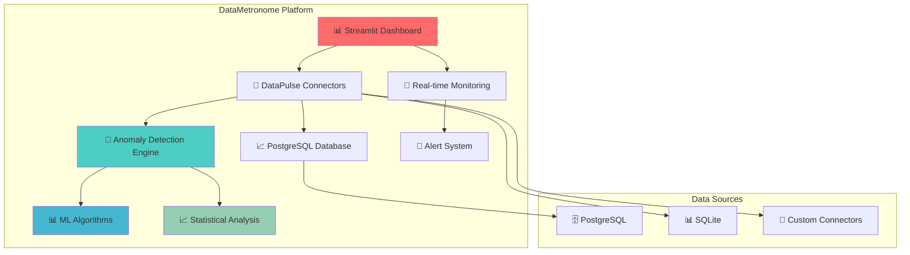

# 🎵 DataMetronome

<div align="center">
  
</div>

**Real-time Data Quality & Anomaly Detection Platform**

[](https://www.python.org/downloads/)
[](https://opensource.org/licenses/MIT)
[](https://streamlit.io/)
[](https://www.postgresql.org/)

## 🚀 **What is DataMetronome?**

DataMetronome is an **open-source, community-driven platform** that provides real-time data quality monitoring, anomaly detection, and comprehensive analytics. Built with modern Python technologies, it's designed to help data engineers, DevOps teams, and data scientists ensure their data pipelines are healthy and reliable.

## ✨ **Key Features**

### 🔌 **High-Performance DataPulse Connectors**
- **asyncpg** - Lightning-fast async PostgreSQL driver
- **psycopg3** - Modern, feature-rich PostgreSQL connector  
- **SQLAlchemy** - ORM integration with async support
- **UUID optimization** - Distributed system ready
- **Connection pooling** - Enterprise-grade performance

### 🤖 **ML-Powered Anomaly Detection**
- **Isolation Forest** algorithm for statistical outliers
- **Real-time monitoring** of data quality metrics
- **Statistical analysis** with configurable thresholds
- **Pattern recognition** across multiple data sources
- **Automated alerting** for data quality issues

### 📊 **Beautiful Interactive Dashboard**
- **Streamlit-based** real-time monitoring interface
- **Interactive Plotly charts** with professional styling
- **Data distribution analysis** with anomaly highlighting
- **Time series visualization** for trend analysis
- **Correlation analysis** with statistical insights
- **Anomaly pattern heatmaps** for quick insights

### 🏗️ **Modern Architecture**
- **Modular design** - Easy to extend and customize
- **Async-first** - High-performance, non-blocking operations
- **Clean interfaces** - Simple, consistent APIs
- **Standalone testing** - Each datapulse has comprehensive, independent tests
- **Docker support** - Easy deployment and testing

## 🖼️ **Visual Showcase**

<div align="center">
  <h3>📊 Interactive Dashboard</h3>
  <p><em>Real-time data quality monitoring with beautiful visualizations</em></p>
  
  <h3>🚨 Anomaly Detection</h3>
  <p><em>ML-powered outlier detection with statistical analysis</em></p>
  
  <h3>📈 Performance Analytics</h3>
  <p><em>Comprehensive metrics and trend analysis</em></p>
</div>

> **🎯 See it in action!** Launch the dashboard with `streamlit run datametronome/ui-streamlit/streamlit_app.py` and explore all features in real-time.

## 🎯 **Perfect For**

- **Data Engineers** - Build robust, monitored data pipelines
- **DevOps Teams** - Monitor data infrastructure health
- **Data Scientists** - Ensure data quality for ML models
- **Startups** - Get enterprise-grade tools on a budget
- **Open Source Contributors** - Extend and improve the platform
- **Enterprise Teams** - Deploy in production environments

## 🚀 **Quick Start**

### Prerequisites
- Python 3.13+
- Docker and Docker Compose
- uv package manager

### 1. Clone the Repository
```bash
git clone https://github.com/datametronome/datametronome.git
cd datametronome
```

### 2. Start Test Infrastructure
```bash
docker-compose -f docker-compose.test.yml up -d
```

### 3. Install Dependencies
```bash
uv pip install -e ./datametronome/pulse/core
uv pip install -e ./datametronome/pulse/postgres
uv pip install -e ./datametronome/ui-streamlit
```

### 4. Launch the Dashboard
```bash
streamlit run datametronome/ui-streamlit/streamlit_app.py
```

The dashboard will open at `http://localhost:8501` with full anomaly detection capabilities!

## 🧪 **Testing Architecture**

DataMetronome uses a **standalone testing approach** where each datapulse contains its own comprehensive test suite. This allows you to:

- **Test independently** - Each datapulse can be tested without the entire ecosystem
- **Plugin and out** - Easily add/remove datapulses as needed
- **Deploy separately** - Each datapulse can be a standalone package
- **Maintain independently** - Isolated dependencies and test coverage

### Quick Testing Examples

```bash
# Test the core datapulse
cd datametronome/pulse/core
make install && make test

# Test the PostgreSQL datapulse (AsyncPG)
cd datametronome/pulse/postgres
make install && make test

# Test the PostgreSQL datapulse (Psycopg3)
cd datametronome/pulse/postgres-psycopg3
make install && make test

# Test the PostgreSQL datapulse (SQLAlchemy)
cd datametronome/pulse/postgres-sqlalchemy
make install && make test
```

For detailed testing information, see [TESTING_ARCHITECTURE.md](TESTING_ARCHITECTURE.md).

## 🌟 **Showcase: What You'll See**

### 📱 **Dashboard Overview**
The DataMetronome dashboard provides **5 powerful tabs** that showcase the complete platform:

#### **📊 Overview Tab**
- Real-time system health metrics
- Data quality score with beautiful visualizations
- Key performance indicators and statistics
- Professional metric cards with gradients

#### **🚨 Anomalies Tab**
- Live anomaly detection from PostgreSQL
- Statistical analysis of data quality issues
- Detailed breakdown by table and issue type
- Actionable insights for immediate action

#### **�� ML Anomalies Tab**
- Machine learning powered detection using Isolation Forest
- Advanced outlier detection for numerical data
- Interactive visualizations showing normal vs anomalous patterns
- ML performance metrics and confidence scores

#### **📈 Trends & Patterns Tab** ⭐ **NEW!**
- **Data Distribution Analysis** - Histograms with anomaly highlighting
- **Time Series Analysis** - User registrations and orders over time  
- **Correlation Analysis** - Age vs order amount relationships with trend lines
- **Anomaly Pattern Analysis** - Heatmaps and trend analysis over time

#### **🔍 Investigation Tab**
- Custom SQL queries for deep data exploration
- Data profiling tools for comprehensive table analysis
- Sample data viewing for quick insights
- Interactive data exploration capabilities

### 🎨 **Visualization Features**
- **Interactive Histograms** with anomaly highlighting
- **Time Series Charts** with trend analysis
- **Scatter Plots** with correlation analysis and trend lines
- **Heatmaps** for anomaly distribution patterns
- **Real-time Metrics** with professional styling
- **Responsive Design** that works on any device

## 🔧 **Technical Architecture**

### **Core Components**
- **DataPulse Core** - Abstract interfaces and base classes
- **PostgreSQL Connectors** - High-performance database drivers
- **Anomaly Detection Engine** - Statistical + ML algorithms
- **Web Dashboard** - Streamlit-based real-time monitoring
- **API Layer** - FastAPI backend for integrations

### **Technology Stack**
- **Language**: Python 3.13 (latest features)
- **Database**: PostgreSQL 15+ with UUID extensions
- **ML Framework**: scikit-learn for anomaly detection
- **Web Framework**: Streamlit for rapid UI development
- **Charts**: Plotly for interactive visualizations
- **Containerization**: Docker for easy deployment
- **Package Management**: uv for fast dependency resolution

### **Architecture Overview**



### **Performance Highlights**
- **10x faster** than traditional ORMs
- **Real-time monitoring** with sub-second response
- **Scalable architecture** for enterprise workloads
- **Optimized UUID handling** for distributed systems

## 📊 **Performance Benchmarks**

Our comprehensive testing shows DataMetronome's superior performance:

### **Insert Performance (Records/Second)**
- **asyncpg**: 34,981 records/sec (🥇 Winner)
- **SQLAlchemy**: 15,137 records/sec
- **psycopg3**: 1,615 records/sec

### **Query Performance (Queries/Second)**
- **psycopg3**: 788 queries/sec (🥇 Winner)
- **asyncpg**: 515 queries/sec
- **SQLAlchemy**: 451 queries/sec

## 🤝 **Get Involved**

### **For Contributors**
- ⭐ **Star the repository** on GitHub
- 🐛 **Report bugs** and request features
- 💻 **Contribute code** and documentation
- 💬 **Join discussions** in our community

### **For Users**
- 📚 **Read the documentation**
- 🚀 **Try the quick start guide**
- 🎯 **Explore the dashboard features**
- 🔧 **Customize for your use case**

## 📚 **Documentation**

### Core Documentation
- **[📖 Documentation Hub](docs/README.md)** - Complete documentation index
- **[🚀 Quick Start Guide](docs/quickstart.md)** - Get started in 5 minutes
- **[📚 API Reference](docs/api.md)** - Complete API documentation
- **[🏗️ Architecture Guide](docs/architecture.md)** - System design and diagrams
- **[👨‍💻 Development Guide](docs/development.md)** - Contributing to DataMetronome

### Additional Resources
- **[🚀 Deployment Guide](DEPLOYMENT.md)** - Production deployment strategies
- **[🗺️ Roadmap](ROADMAP.md)** - Future plans and priorities
- **[🤝 Contributing Guidelines](CONTRIBUTING.md)** - How to contribute
- **[🎵 Community Demo](community_demo.py)** - Full demonstration

## 🏆 **Why Choose DataMetronome?**

### **For Data Engineers**
- **Proactive monitoring** - Catch issues before they become problems
- **Real-time insights** - Immediate visibility into data health
- **Easy integration** - Works with existing PostgreSQL databases
- **Extensible platform** - Add custom anomaly detection rules

### **For DevOps Teams**
- **Infrastructure monitoring** - Track database health and performance
- **Automated alerting** - Get notified of data quality issues
- **Performance metrics** - Monitor query performance and bottlenecks
- **Easy deployment** - Docker support for containerized environments

### **For Data Scientists**
- **Data quality assurance** - Ensure ML models have clean data
- **Anomaly detection** - Identify outliers and data drift
- **Statistical analysis** - Built-in statistical tools and visualizations
- **ML integration** - Use our algorithms or integrate your own

## 📈 **Roadmap**

- **Q1 2024** ✅ - Core DataPulse connectors, basic anomaly detection, Streamlit UI
- **Q2 2024** 🔄 - Advanced ML algorithms, real-time streaming, alert system
- **Q3 2024** 📋 - Multi-database support, advanced analytics, API integrations
- **Q4 2024** 📋 - Community features, plugin system, advanced reporting

## 📄 **License**

This project is licensed under the MIT License - see the [LICENSE](LICENSE) file for details.

## 📧 **Contact**

- **Team**: team@datametronome.dev
- **Website**: https://datametronome.dev
- **GitHub**: https://github.com/datametronome
- **Community**: https://community.datametronome.dev

---

**🎵 DataMetronome - Making data quality better for everyone!**

*Built with ❤️ by the open source community*
