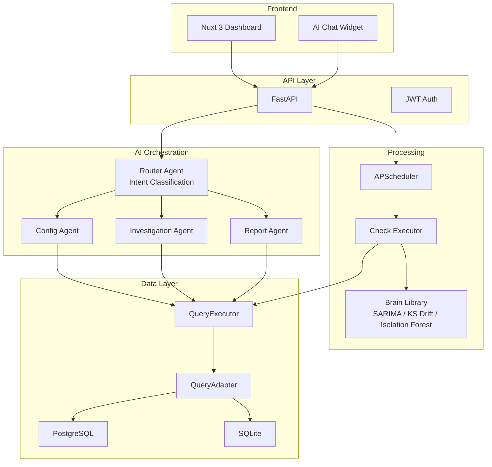
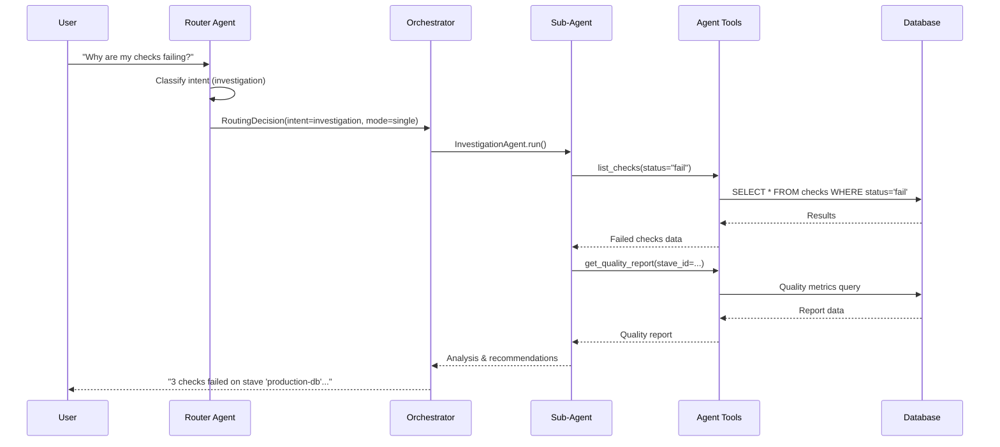
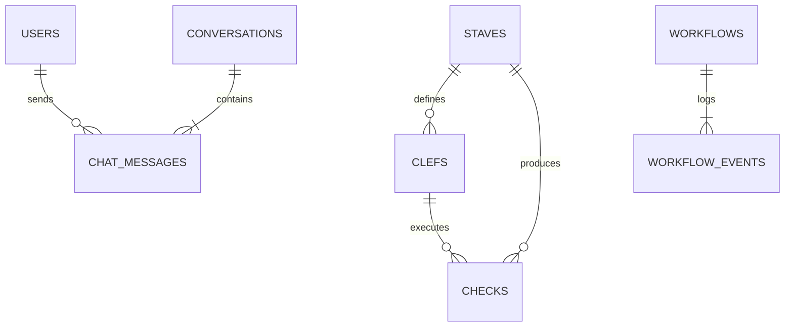

# 🎵 DataMetronome

<div align="center">
  

  **Open-Source Data Quality Monitoring with AI-Powered Multi-Agent Assistance**

  [](https://www.python.org/downloads/)
  [](https://fastapi.tiangolo.com/)
  [](https://nuxt.com/)
  [](https://www.postgresql.org/)
  [](https://ai.pydantic.dev/)
  [](https://opensource.org/licenses/MIT)
  [](https://deepwiki.com/TheDataMaestros/datametronome)
</div>

---

## 🚀 What is DataMetronome?

DataMetronome is an open-source data quality monitoring platform that combines declarative YAML-based checks with ML-powered anomaly detection and an AI multi-agent assistant. Define quality rules as code, get SARIMA forecasting and drift detection out of the box, and chat with an AI that can investigate failures, generate reports, and configure new checks — all from a single dashboard.

---

## 🏗️ Architecture Overview



---

## ✨ Key Features

### 🎯 Data Quality Monitoring
Define checks as code in YAML and run them on a schedule across multiple databases:
- **row_count** — Ensure minimum/maximum record volumes
- **freshness** — Detect stale data and pipeline delays
- **null_percentage** — Track data completeness
- **value_range** — Enforce business-rule bounds
- **pattern_match** — Validate formats with regex
- **unique_percentage** — Catch duplicates

### 🧠 ML-Powered Anomaly Detection
Advanced statistical checks that learn from your data:
- **SARIMA Forecasting** — Predict expected metrics and flag deviations
- **KS Drift Detection** — Spot when data distributions shift
- **Isolation Forest** — Identify outliers in multi-dimensional data

### 🤖 AI Multi-Agent Assistant
Chat with an AI that understands your data quality pipeline:
- **Structured LLM routing** via Pydantic AI with intent classification
- **3 specialized agents** — Config, Investigation, Report
- **Dispatch modes** — Single, chain, or parallel agent execution
- **Multi-provider** — Anthropic, OpenAI, Gemini, Ollama
- **Conversation memory** and workflow checkpoints

---

## 💬 Multi-Agent Chat Flow



---

## Quick Start

### Docker Compose (recommended)

```bash
git clone https://github.com/datametronome/datametronome.git
cd datametronome
cp env.example .env

# Start the full stack (API + PostgreSQL + Redis + RabbitMQ + UI)
make up
```

- **API:** http://localhost:8001
- **UI:** http://localhost:3000
- **Login:** `admin` / `admin`

```bash
# Start with Celery workers (adds worker + Beat scheduler containers)
make up-workers

# Run database migrations
make migrate

# View logs
make logs

# Stop everything
make down
```

### Create Your First Check

Create `my_first_stave.yaml`:

```yaml
staves:
  - id: "users-db-001"
    name: "User Database"
    data_source_type: "sqlite"
    connection_config:
      path: "./data/users.db"
    clefs:
      - id: "user-volume"
        name: "Daily User Signups"
        check_type: "row_count"
        config:
          table: "users"
          where: "created_at >= date('now', '-1 day')"
        fail:
          min: 10  # Alert if fewer than 10 signups/day

      - id: "email-quality"
        name: "Email Completeness"
        check_type: "null_percentage"
        config:
          table: "users"
          column: "email"
        warn:
          max: 5  # Warn if more than 5% NULL emails
```

Import and run:

```bash
python -m datametronome_podium.services.stave_yaml_loader my_first_stave.yaml
```

---

## 🔧 Tech Stack

| Component | Technology | Purpose |
|-----------|-----------|---------|
| Backend | FastAPI + Python 3.13 | REST API, async architecture |
| AI Agents | Pydantic AI | Multi-agent orchestration |
| Frontend | Nuxt 3 + NuxtUI | Dashboard & chat interface |
| Database | PostgreSQL 15+ / SQLite | Primary storage |
| ML Engine | statsmodels + scipy + scikit-learn | Anomaly detection |
| Connectors | asyncpg + aiosqlite | High-performance DB access |
| Scheduling | APScheduler | Automated check execution |

---

## 📐 Data Model



- **Staves** — Data sources (databases, schemas, tables) to monitor
- **Clefs** — Quality check definitions attached to a stave
- **Checks** — Execution results with pass/warn/fail status

---

## 🧪 Check Types Reference

### Declarative Checks

| Check Type | Description | Use Case |
|------------|-------------|----------|
| `row_count` | Validate table size | Volume monitoring |
| `freshness` | Check data recency | Detect pipeline delays |
| `null_percentage` | Measure completeness | Data quality SLAs |
| `unique_percentage` | Detect duplicates | Deduplication validation |
| `value_range` | Validate bounds | Business rule enforcement |
| `pattern_match` | Regex validation | Format compliance |

### ML / Statistical Checks

| Check Type | Algorithm | Use Case |
|------------|-----------|----------|
| `forecast` | SARIMA | Anomaly detection in time series |
| `data_profile_drift` | KS Test | Distribution shift detection |
| `isolation_forest` | Isolation Forest | Multi-dimensional outlier detection |

---

## 📸 Visual Showcase

### Dashboard Overview
<div align="center">
  
  <p><em>Modern Nuxt dashboard with real-time monitoring and metrics</em></p>
</div>

### Quality Checks - Retail Demo
<div align="center">
  
  <p><em>All 4 checks (Level 1 & 2) for the Retail Production DB</em></p>
</div>

### ML-Powered Anomaly Detection
<div align="center">
  
  <p><em>Advanced anomaly detection with statistical analysis</em></p>
</div>

---

## Live Demo

A **Retail Demo** is included so you can see DataMetronome in action with synthetic e-commerce data (60 days of order history, volume anomalies, pricing drift).

```bash
# Start the stack
make up

# Import retail demo data (from a separate terminal)
export DB_PATH="$(pwd)/datametronome/podium/data/retail.db"
python showcase/retail_demo/import_to_podium.py

# Run tests to verify everything is working
make test
```

See [docs/TUTORIAL.md](docs/TUTORIAL.md) for a detailed walkthrough.

---

## 📁 Project Structure

```
datametronome/
├── datametronome/
│   ├── podium/          # FastAPI backend (API, agents, scheduler)
│   ├── brain/           # ML models (SARIMA, KS, Isolation Forest)
│   ├── pulse/           # Database connectors (postgres, sqlite)
│   └── plugins/         # Extension system
├── ui-nuxt/             # Nuxt 3 frontend (dashboard, chat widget)
├── showcase/            # Demo scenarios (retail demo)
├── docker-compose.yml   # Docker Compose stack
├── env.example          # Environment template
└── Makefile             # Common tasks
```

---

## 🤝 Contributing

Contributions are welcome! Whether it is a bug fix, new check type, additional connector, or documentation improvement — we appreciate it.

1. **Star the repo** ⭐ to show your support
2. **Read** the [Contributing Guide](CONTRIBUTING.md)
3. **Pick an issue** from [GitHub Issues](https://github.com/datametronome/datametronome/issues)
4. **Submit a PR** with tests

---

## 📄 License

MIT License — see [LICENSE](LICENSE) for details.

---

<div align="center">

**🎵 DataMetronome — Making data quality rhythmic, reliable, and intelligent.**

[Get Started](#-quick-start) · [View Demo](#-live-demo) · [Contributing](CONTRIBUTING.md)

</div>
