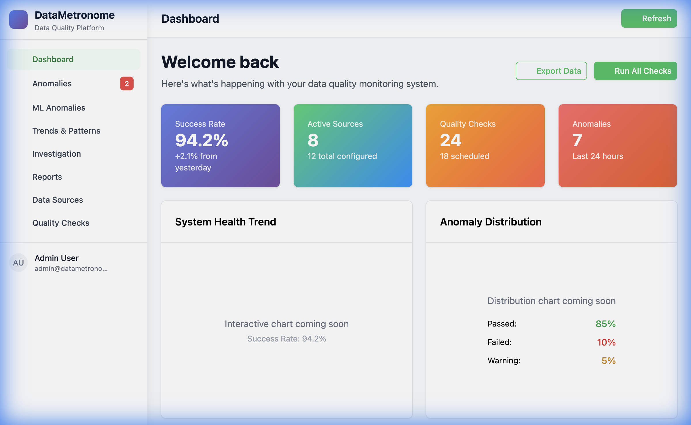
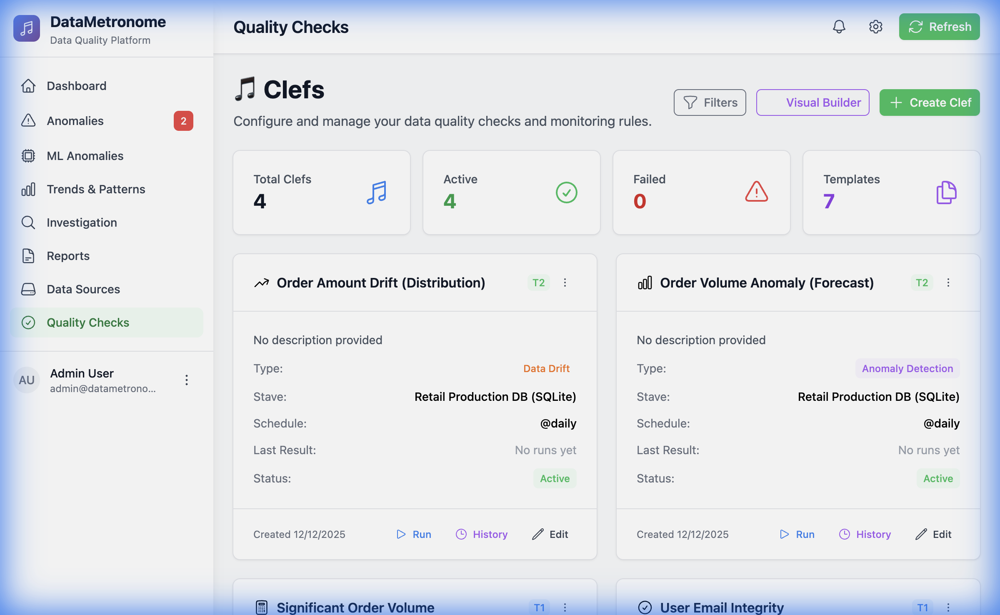
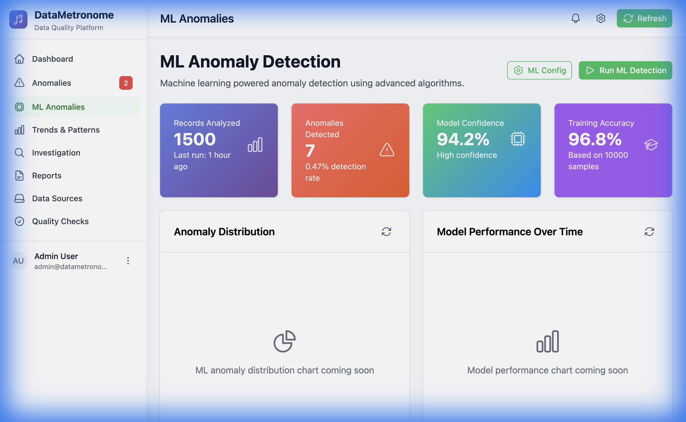
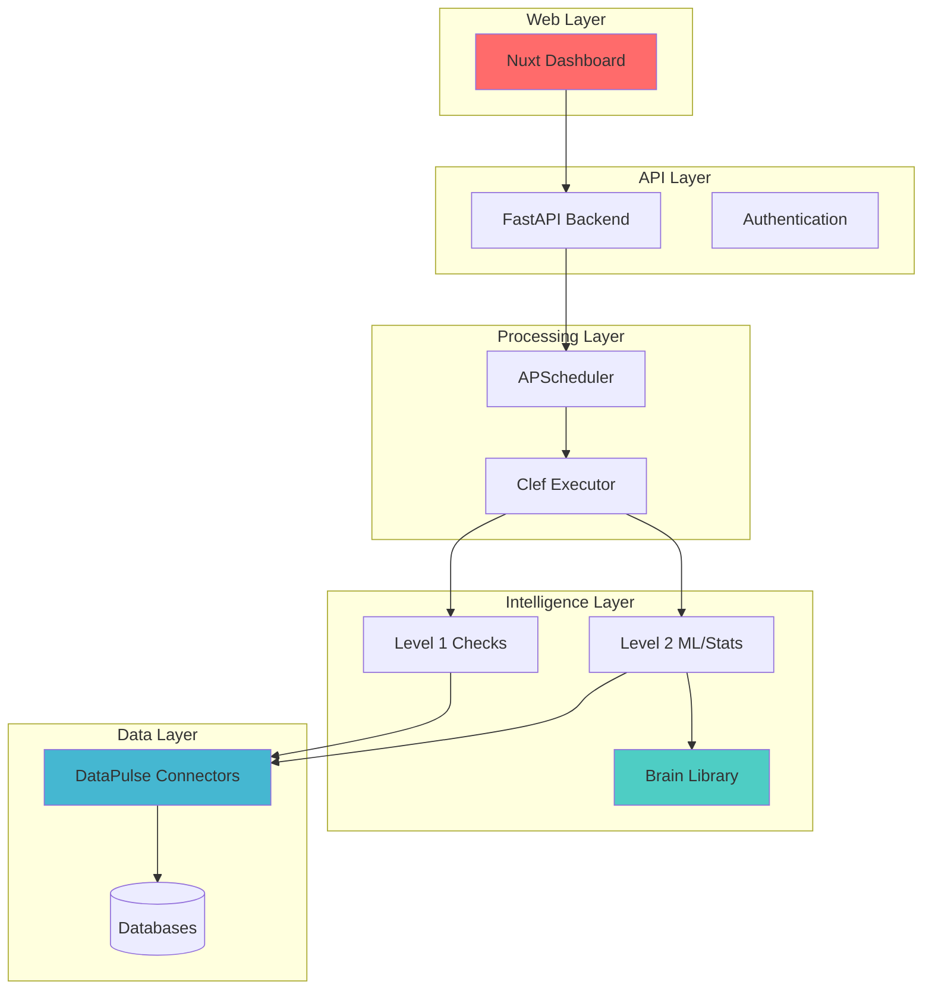

# 🎵 DataMetronome

<div align="center">
  

  **Production-Ready Data Quality & Anomaly Detection Platform**

  [](https://www.python.org/downloads/)
  [](https://opensource.org/licenses/MIT)
  [](https://deepwiki.com/TheDataMaestros/datametronome)
</div>

---

## 🚀 What is DataMetronome?

DataMetronome is a **production-ready, open-source platform** for real-time data quality monitoring and ML-powered anomaly detection. Define your data quality checks in simple YAML files, deploy in minutes, and get instant visibility into your data health.

**Why DataMetronome?**
- ✅ **Declarative Configuration** - Define checks as code (YAML)
- 🧠 **ML-Powered Detection** - SARIMA forecasting & distribution drift analysis
- 📊 **Beautiful Dashboard** - Modern Nuxt UI with real-time monitoring
- 🚀 **Production Ready** - Battle-tested with async architecture
- 🔌 **Multi-Database** - PostgreSQL, SQLite, and growing

---

## ✨ Key Features

### 🎯 **Level 1: Declarative Quality Checks**
Write simple YAML to monitor your data:
- **Row Count** - Ensure minimum/maximum record volumes
- **Freshness** - Detect stale data and lag
- **Null Percentage** - Track data completeness
- **Value Validation** - Check ranges, patterns, uniqueness

### 🧠 **Level 2: ML-Powered Anomaly Detection**
Advanced statistical checks that learn from your data:
- **SARIMA Forecasting** - Predict expected metrics and flag deviations
- **Distribution Drift** - Detect when data distributions shift (KS test)
- **Isolation Forest** - Identify outliers in multi-dimensional data
- **Pattern Recognition** - Automated learning of normal behavior

### 📊 **Interactive Dashboard**
- **Real-time Monitoring** - Live updates of check status
- **Trend Visualization** - Chart.js powered analytics
- **Anomaly Insights** - Drill down into detected issues
- **Dark/Light Themes** - Professional styling for operations teams
- **Responsive Design** - Works on desktop, tablet, and mobile

### 🏗️ **Production Architecture**
- **Async-First** - Built on asyncio for high performance
- **Modular Design** - Pure Python packages, no monolith
- **Docker Ready** - Containerized deployment included
- **API-Driven** - FastAPI backend for integrations
- **Hot Reload** - Update checks without service restarts

---

## 🎬 Live Demo

We've created a **working Retail Demo** that you can run locally to see DataMetronome in action.

### What's Included

The demo showcases a realistic e-commerce scenario with:
- 📦 **60 days** of synthetic order history
- 👥 **User registration data** with email validation
- 💰 **Order amounts** with simulated pricing drift
- 📉 **Volume anomaly** (30% drop simulation)

### Quality Checks Demonstrated

1. **User Email Integrity** (Level 1)
   - Validates < 5% NULL emails

2. **Significant Order Volume** (Level 1)
   - Ensures > 1000 orders minimum

3. **Order Volume Anomaly** (Level 2 - ML) 🧠
   - SARIMA forecasting on 60-day history
   - Detects unexpected volume drops

4. **Order Amount Drift** (Level 2 - ML) 🧠
   - KS test for distribution changes
   - Catches pricing bugs automatically

### Retail Demo (Full Stack: API + UI)

#### Prerequisites
- Python 3.13+
- Node.js 18+

#### Generated demo artifacts (local)
The Retail demo uses a **synthetic dataset generated locally** (SQLite). These files are **not committed to git**:
- **Retail dataset DB**: `datametronome/podium/data/retail.db` (source data the checks query)
- **Podium app DB**: `datametronome/podium/data/datametronome.db` (stores staves/clefs/results)

#### Run (recommended)
From the repo root:

```bash
# 0) Create .env file from env.example (if not already exists)
make setup-env

# 1) Install Python packages (uses `uv` under the hood; see Makefile: install)
make install

# 2) Generate the retail dataset DB (SQLite)
make retail-db

# 3) Import the Retail stave/clefs from YAML into Podium (DB_PATH must be absolute)
#    This also automatically generates historical check results for better visualization
export DB_PATH="$(pwd)/datametronome/podium/data/retail.db"
python3 showcase/retail_demo/import_to_podium.py

# 4) Start Podium API (default: http://localhost:8000 via .env)
make start-podium
```

In a new terminal (repo root):

```bash
# 5) Start the UI (default: http://localhost:3000) and point it at Podium
NUXT_PUBLIC_API_BASE="http://127.0.0.1:8000/api/v1" \
NUXT_PUBLIC_PODIUM_API_BASE="http://127.0.0.1:8000" \
make start-ui
```

#### Validate
- **UI**: http://localhost:3000 (login: `admin` / `admin`)
- **In-app**:
  - Go to **Quality Checks** → click on any check card to see detailed graphs with historical data
  - Historical check results are automatically generated during import, showing:
    - **Drift checks**: 7 days of baseline data + gradual drift pattern
    - **Forecast checks**: 7 days of normal behavior + today's anomaly

#### Reset
Delete the generated SQLite files:
- `datametronome/podium/data/datametronome.db`
- `datametronome/podium/data/retail.db`

#### Troubleshooting
- If checks fail with “DB file not found”, re-run the import with `DB_PATH` set to an **absolute** path.
- If the UI shows API errors, confirm Podium is running and the UI points to the correct Podium port (`NUXT_PUBLIC_API_BASE`).

<details>
<summary>Optional: CLI smoke test (no API/UI)</summary>

If you just want a fast smoke run (no API/UI), this runs the generator + checks and prints a report:

```bash
python3 showcase/retail_demo/run_demo.py
```

</details>

> 💡 **Tip**: Check out the [complete walkthrough](docs/TUTORIAL.md) for a detailed guide!

---

## 📸 Visual Showcase

### Dashboard Overview
<div align="center">
  
  <p><em>Modern Nuxt dashboard with real-time monitoring and metrics</em></p>
</div>

### Quality Checks - Retail Demo
<div align="center">
  
  <p><em>All 4 checks (Level 1 & 2) for the Retail Production DB</em></p>
</div>

### ML-Powered Anomaly Detection
<div align="center">
  
  <p><em>Advanced anomaly detection with statistical analysis</em></p>
</div>

---

## 🚀 Quick Start

### Prerequisites
- Python 3.13+
- Node.js 18+ (for UI)
- Docker (optional, for databases)

### 1. Install Core Packages

```bash
# Install the main components
uv pip install -e ./datametronome/podium
uv pip install -e ./datametronome/pulse/postgres  # or /sqlite
uv pip install -e ./datametronome/brain/base
```

### 2. Create Your First Check

Create `my_first_stave.yaml`:

```yaml
staves:
  - id: "users-db-001"
    name: "User Database"
    data_source_type: "sqlite"
    connection_config:
      path: "./data/users.db"
    clefs:
      - id: "user-volume"
        name: "Daily User Signups"
        check_type: "row_count"
        config:
          table: "users"
          where: "created_at >= date('now', '-1 day')"
        fail:
          min: 10  # Alert if < 10 signups/day

      - id: "email-quality"
        name: "Email Completeness"
        check_type: "null_percentage"
        config:
          table: "users"
          column: "email"
        warn:
          max: 5  # Warn if > 5% NULL emails
```

### 3. Import and Run

```bash
# Import configuration
python -m datametronome_podium.services.stave_yaml_loader my_first_stave.yaml

# Start the backend
cd datametronome/podium
python -m datametronome_podium.main

# Start the UI
cd ui-nuxt
npm run dev
```

**View Results**: http://localhost:3000

---

## 📊 Architecture



### Component Breakdown

| Component | Technology | Purpose |
|-----------|-----------|---------|
| **Podium** | FastAPI + APScheduler | Backend API & job orchestration |
| **Brain** | scikit-learn + statsmodels | ML models & statistical tests |
| **DataPulse** | asyncpg, psycopg3, aiosqlite | High-performance DB connectors |
| **UI** | Nuxt 3 + Chart.js | Interactive dashboard |

---

## 🔌 Data Source Support

| Database | Connector | Status | Performance |
|----------|-----------|--------|-------------|
| PostgreSQL | asyncpg | ✅ Production | 34,981 inserts/sec |
| PostgreSQL | psycopg3 | ✅ Production | 788 queries/sec |
| PostgreSQL | SQLAlchemy | ✅ Production | ORM support |
| SQLite | aiosqlite | ✅ Production | Embedded & testing |
| MySQL | - | 📋 Planned | Q1 2025 |
| BigQuery | - | 📋 Planned | Q2 2025 |

> **Extensible**: Write your own DataPulse connector in ~100 lines!

---

## 🧪 Check Types Reference

### Level 1: Declarative Checks

| Check Type | Description | Use Case |
|------------|-------------|----------|
| `row_count` | Validate table size | Volume monitoring |
| `freshness` | Check data recency | Detect pipeline delays |
| `null_percentage` | Measure completeness | Data quality SLAs |
| `unique_percentage` | Detect duplicates | Deduplication validation |
| `value_range` | Validate bounds | Business rule enforcement |
| `pattern_match` | Regex validation | Format compliance |

### Level 2: ML/Statistical Checks

| Check Type | Algorithm | Use Case |
|------------|-----------|----------|
| `forecast` | SARIMA | Anomaly detection in time series |
| `data_profile_drift` | KS Test | Distribution shift detection |
| `isolation_forest` | Isolation Forest | Multi-dimensional outlier detection |

---

## 📈 Performance Benchmarks

Based on our comprehensive testing:

### Insert Performance
```
asyncpg:      34,981 records/sec  🥇
SQLAlchemy:   15,137 records/sec
psycopg3:      1,615 records/sec
```

### Query Performance
```
psycopg3:     788 queries/sec  🥇
asyncpg:      515 queries/sec
SQLAlchemy:   451 queries/sec
```

### Real-World Impact
- **10x faster** than traditional ORMs for bulk operations
- **Sub-second** anomaly detection on datasets up to 1M rows
- **<100ms** API response times under load

---

## 🎯 Use Cases

### For Data Engineers
- **Pipeline Monitoring** - Track ETL job outputs
- **SLA Compliance** - Enforce data delivery contracts
- **Automated Testing** - CI/CD data validation

### For DevOps Teams
- **Infrastructure Health** - Monitor database performance
- **Incident Detection** - Alert on data anomalies
- **Capacity Planning** - Track growth trends

### For Data Scientists
- **Feature Store Quality** - Validate ML training data
- **Drift Detection** - Monitor model input distributions
- **Data Auditing** - Track data lineage and quality

---

## 📚 Documentation

### Getting Started
- 📖 [**Complete Tutorial**](docs/TUTORIAL.md) - Build a retail monitoring pipeline
- 🚀 [**Quick Start**](docs/quickstart.md) - 5-minute setup guide
- 🎵 [**Community Demo**](community_demo.py) - Full example walkthrough

### Advanced Topics
- 🏗️ [**Architecture Guide**](docs/architecture.md) - System design deep-dive
- 🔌 [**DataPulse Development**](docs/development.md) - Write custom connectors
- 📊 [**ML Integration**](datametronome/brain/base/README.md) - Extend anomaly detection
- 🚀 [**Deployment**](DEPLOYMENT.md) - Production deployment strategies

### Reference
- 📚 [**API Documentation**](docs/api.md) - REST API reference
- 🧪 [**Testing Guide**](TESTING_ARCHITECTURE.md) - Testing architecture
- 🗺️ [**Roadmap**](ROADMAP.md) - Future plans
- 🤝 [**Contributing**](CONTRIBUTING.md) - Contribution guidelines

---

## 🗺️ Roadmap

### ✅ Completed (2024)
- Level 1 declarative checks (row_count, freshness, nulls, etc.)
- Level 2 ML checks (SARIMA, KS drift, Isolation Forest)
- YAML-based configuration with hot reload
- Nuxt 3 dashboard with real-time monitoring
- Multi-connector architecture (PostgreSQL, SQLite)
- Comprehensive test coverage

### 🔄 In Progress (Q4 2024)
- Enhanced documentation and tutorials
- Community features and demos
- Performance optimizations
- Security hardening

### 📋 Planned (2025)
- **Q1**: MySQL connector, advanced analytics, webhooks
- **Q2**: BigQuery support, data lineage tracking
- **Q3**: Custom ML model integration, alerting strategies
- **Q4**: Enterprise features, multi-tenant architecture

---

## 🤝 Contributing

We welcome contributions! Here's how to get started:

1. **Star the repo** ⭐ to show your support
2. **Read** our [Contributing Guide](CONTRIBUTING.md)
3. **Pick an issue** from our [GitHub board](https://github.com/datametronome/datametronome/issues)
4. **Submit a PR** with tests and documentation

### Contributors
Built with ❤️ by the open source community.

---

## 📄 License

MIT License - see [LICENSE](LICENSE) file for details.

---

## 📧 Contact & Community

- **GitHub**: https://github.com/datametronome/datametronome
- **Email**: team@datametronome.dev
- **Website**: https://datametronome.dev (coming soon)

---

<div align="center">

**🎵 DataMetronome - Making data quality better for everyone.**

*Built by data engineers, for data engineers*

[Get Started](#-quick-start) • [View Demo](#-live-demo) • [Read Docs](docs/README.md)

</div>
