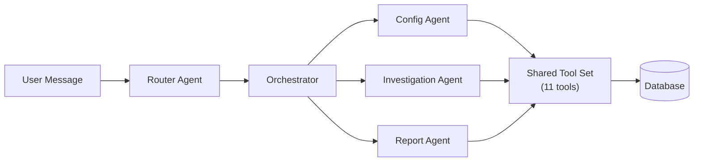
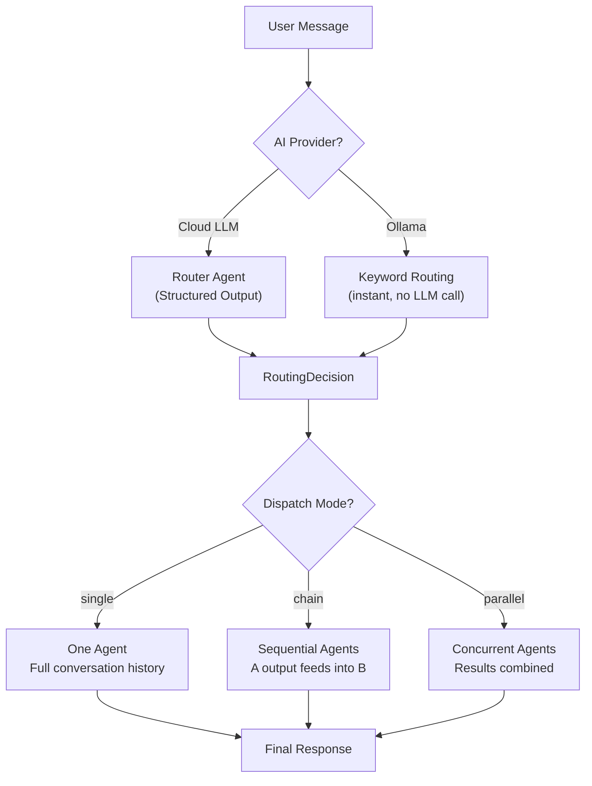
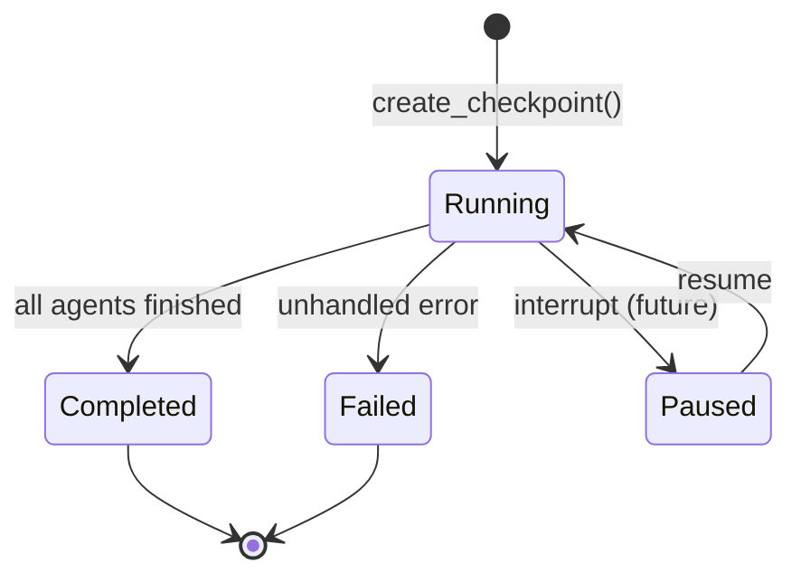
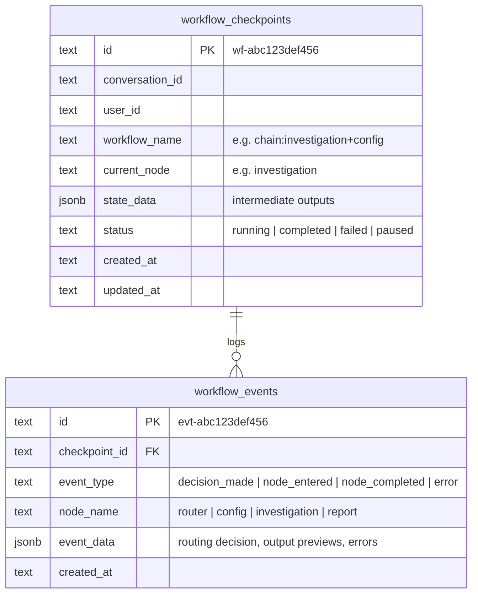
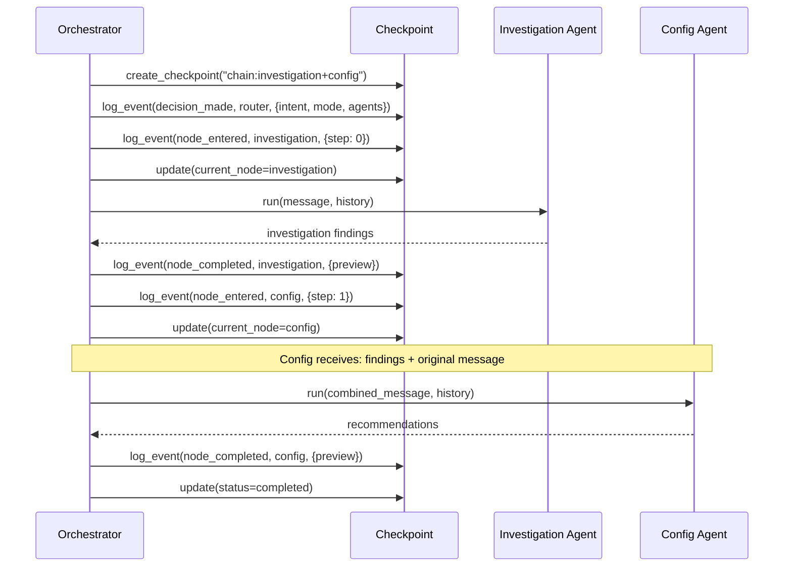
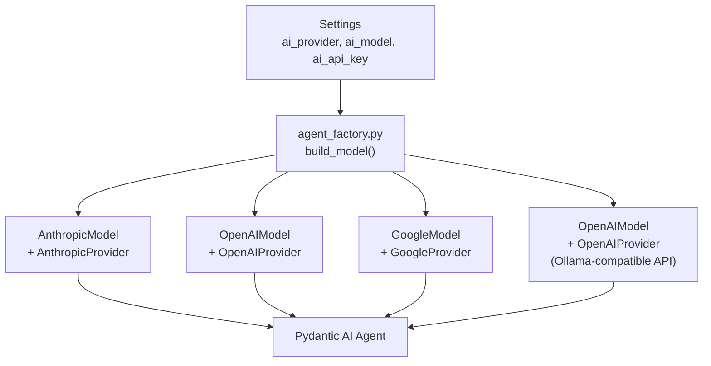
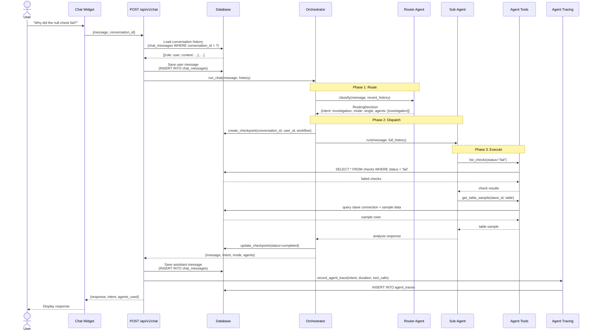
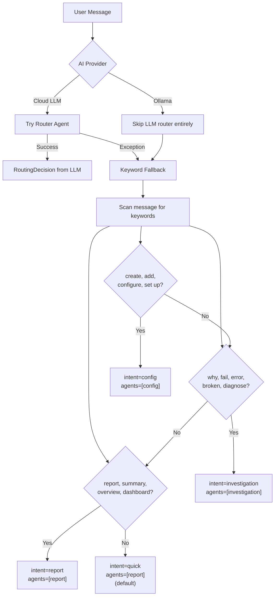

# DataMetronome AI Assistant

A multi-agent AI system built on [Pydantic AI](https://ai.pydantic.dev/) that gives users conversational access to data quality monitoring -- from configuring data sources to investigating failures to generating reports.

---

## Table of Contents

- [Overview](#overview)
- [Three-Phase Routing](#three-phase-routing)
- [RoutingDecision Schema](#routingdecision-schema)
- [Sub-Agents](#sub-agents)
- [Agent Tools](#agent-tools)
- [Workflow Checkpoints](#workflow-checkpoints)
- [Multi-Provider Support](#multi-provider-support)
- [Conversation Flow](#conversation-flow)
- [Fallback Routing](#fallback-routing)

---

## Overview

The AI assistant transforms DataMetronome from a dashboard-only platform into a conversational data quality tool. Instead of navigating through menus, users can type natural language requests:

> "Why did the null check on the orders table fail yesterday?"

> "Create a new stave for my PostgreSQL analytics database"

> "Give me a quality report for the last 7 days"

### Why Multi-Agent?

A single monolithic agent struggles with diverse tasks. Configuration requires careful, step-by-step guidance. Investigation requires analytical reasoning. Reporting requires concise summarization. Each specialization benefits from a tailored system prompt and dispatch strategy.

The multi-agent architecture solves this with three components:

1. **Router** -- a fast, cheap LLM call that classifies intent and selects agents
2. **Sub-Agents** -- specialized agents (config, investigation, report) with focused system prompts
3. **Orchestrator** -- dispatches agents in single, chain, or parallel mode based on the routing decision



---

## Three-Phase Routing

Every user message flows through three phases: **classify**, **decide**, **dispatch**.



### Phase 1: Classification

The Router Agent receives the user message plus the last 6 messages of conversation history (for context). It returns a structured `RoutingDecision` with no prose -- just the classification.

For Ollama providers, the router is bypassed entirely. Keyword matching provides instant routing without burning a slow local LLM call on classification.

### Phase 2: Decision

The `RoutingDecision` specifies:
- **What** the user wants (intent)
- **How** to handle it (mode)
- **Who** should handle it (agents)

### Phase 3: Dispatch

The orchestrator dispatches based on mode:

| Mode | Behavior | Example Use Case |
|------|----------|-----------------|
| `single` | One agent handles everything | "List my staves" |
| `chain` | Agent A runs first, its output feeds into Agent B | "Why did this check fail and how should I fix it?" |
| `parallel` | Agents A and B run concurrently, results are combined | "Give me an overview and suggest improvements" |

---

## RoutingDecision Schema

The router returns a Pydantic model with structured fields -- no regex parsing needed:

```python
class RoutingDecision(BaseModel):
    intent: Literal["quick", "config", "investigation", "report", "exploration"]
    mode: Literal["single", "chain", "parallel"]
    agents: list[Literal["config", "investigation", "report"]]
    reasoning: str  # short explanation for tracing/debugging
```

### Intent Definitions

| Intent | Description | Example Messages |
|--------|------------|-----------------|
| `quick` | Simple greetings, status checks, counts | "Hello", "How many staves do I have?" |
| `config` | Creating or configuring staves and clefs | "Add a new PostgreSQL data source", "Set up a null check" |
| `investigation` | Diagnosing failures, root cause analysis | "Why did the orders check fail?", "What went wrong?" |
| `report` | Summaries, dashboards, quality overviews | "Give me a quality report", "System status" |
| `exploration` | Browsing tables, sampling data | "Show me the tables in my analytics stave" |

### Mode + Agent Rules

| Scenario | Mode | Agents | Why |
|----------|------|--------|-----|
| Simple question | `single` | `["report"]` | One agent is enough |
| Set up a data source | `single` | `["config"]` | Configuration task |
| Why did X fail? | `single` | `["investigation"]` | Diagnostic task |
| Diagnose AND fix | `chain` | `["investigation", "config"]` | Investigation feeds recommendations |
| Overview + suggestions | `parallel` | `["report", "config"]` | Independent tasks, run concurrently |

---

## Sub-Agents

All sub-agents share the same 11-tool set but have different system prompts that focus their behavior:

| Agent | Role | System Prompt Focus | Typical Dispatch |
|-------|------|-------------------|-----------------|
| **Config** | Set up data sources and quality checks | Action-oriented: create staves, configure clefs, suggest checks. Never asks for IDs when it can discover them via tools. | `intent: config` |
| **Investigation** | Diagnose failures, explore data, analyze anomalies | Analytical: call `list_checks` and `get_quality_report` first, then drill into `get_table_sample` for root cause. | `intent: investigation` |
| **Report** | Provide overviews, summaries, quality reports | Summarization: lead with `get_summary_report` for a high-level view, then drill down as needed. | `intent: report`, `intent: quick` |

All agents share a key instruction: **use conversation history**. When a user refers to "this stave" or "that check", agents look at prior messages rather than asking the user to repeat information.

### Agent Construction

Each agent is built with the Pydantic AI `Agent` class:

```python
from pydantic_ai import Agent

agent = Agent(
    model=model,                    # Provider-specific model instance
    system_prompt=_SYSTEM_PROMPT,   # Specialized instructions
    tools=ALL_TOOLS,                # Shared 11-tool set
)
```

The `model` is constructed by `agent_factory.py` based on environment configuration. The router agent additionally specifies `output_type=RoutingDecision` for structured output.

---

## Agent Tools

All 11 tools are defined as standalone async functions in `services/agent_tools.py`. They call the database directly (no HTTP) and have no runtime dependencies on agent state.

| # | Tool | Description | Returns |
|---|------|------------|---------|
| 1 | `list_staves` | List all data sources with optional pagination and active-only filter | Stave list with connection details |
| 2 | `get_stave` | Get a single stave by ID | Stave details |
| 3 | `create_stave` | Create a new data source with connection configuration | Created stave |
| 4 | `list_stave_tables` | List all tables in a stave's connected database | Table names and row counts |
| 5 | `get_table_sample` | Sample rows from a table in a connected database | Sample data with column types |
| 6 | `suggest_quality_checks` | Analyze a table and suggest appropriate quality checks | Suggested clef configurations |
| 7 | `list_clefs` | List quality check definitions with optional stave filter | Clef list with schedules |
| 8 | `get_clef` | Get a single clef by ID | Clef details |
| 9 | `list_checks` | List check execution results with optional status filter | Check results with pass/fail/warn |
| 10 | `get_summary_report` | System-wide status summary over a time period | Stave count, check stats, health |
| 11 | `get_quality_report` | Detailed quality metrics with trend analysis | Pass rates, failure patterns, trends |

### Tool Design Principles

- **Self-contained** -- each tool handles its own database access and error handling
- **Rich return types** -- tools return structured dicts, not raw SQL rows
- **Analytical helpers** -- `suggest_quality_checks` includes data profiling that analyzes sample data to recommend null checks, range checks, uniqueness checks, etc.
- **No side-channel state** -- tools receive all needed parameters as function arguments

---

## Workflow Checkpoints

The orchestrator persists execution state as workflow checkpoints, enabling audit trails and future support for pause/resume.



### Checkpoint Data Model

Each orchestration run creates a **checkpoint** that tracks the current execution state:



### Event Types

| Event Type | Node | When | Data |
|-----------|------|------|------|
| `decision_made` | `router` | After routing | intent, mode, agents, reasoning |
| `node_entered` | agent name | Before agent runs | step number (for chains) |
| `node_completed` | agent name | After agent finishes | output preview (first 200 chars) |
| `error` | `null` | On exception | error message |

### Example: Chain Execution Timeline



---

## Multi-Provider Support

The AI assistant works with any LLM provider through the `agent_factory.py` abstraction layer. All providers use the Pydantic AI `Model + Provider` pattern.

| Provider | Model Examples | Config | Notes |
|----------|---------------|--------|-------|
| **Anthropic** | `claude-sonnet-4-6`, `claude-haiku-4-5` | `AI_PROVIDER=anthropic`<br/>`AI_API_KEY=sk-ant-...` | Best structured output for routing |
| **OpenAI** | `gpt-4o`, `gpt-4o-mini` | `AI_PROVIDER=openai`<br/>`AI_API_KEY=sk-...` | Strong tool calling |
| **Google Gemini** | `gemini-1.5-flash`, `gemini-1.5-pro` | `AI_PROVIDER=gemini`<br/>`AI_API_KEY=...` | Cost-effective |
| **Ollama** | `qwen2.5`, `llama3`, `mistral` | `AI_PROVIDER=ollama`<br/>`AI_BASE_URL=http://localhost:11434/v1` | Local, no API key needed. Uses keyword routing (no router LLM call). |

### Configuration Example

```bash
# Use Claude for agents, Haiku for the cheaper routing step
DATAMETRONOME_AI_PROVIDER=anthropic
DATAMETRONOME_AI_MODEL=claude-sonnet-4-6
DATAMETRONOME_AI_API_KEY=sk-ant-your-key-here
DATAMETRONOME_AI_ROUTER_MODEL=claude-haiku-4-5
```

The `AI_ROUTER_MODEL` setting is optional. When set, the routing step uses a cheaper/faster model while the actual agents use the main model. This is recommended for production to reduce costs -- routing only needs classification accuracy, not generation quality.

### Provider Architecture



Note: Ollama uses the OpenAI-compatible endpoint (`/v1`) with a dummy API key, which is how Pydantic AI connects to local models.

---

## Conversation Flow

The full lifecycle of a chat message, from user input to stored response:



### Conversation History Management

- Messages are persisted in `chat_messages` with `conversation_id` grouping
- Full history is passed to sub-agents for context continuity
- The router only receives the last 6 messages (configurable via `router_history_window`) to keep routing fast and cheap
- Agent traces are recorded separately for observability (duration, intent, tool calls, model used)

---

## Fallback Routing

When the LLM router fails to produce valid structured output -- or when using Ollama (where structured output is slow and unreliable) -- the orchestrator falls back to keyword-based routing.



### Keyword Priority

The fallback checks keywords in this order:

1. **Config keywords**: `create`, `add`, `configure`, `set up`, `connect`
2. **Investigation keywords**: `why`, `fail`, `error`, `broken`, `diagnose`, `wrong`
3. **Report keywords**: `report`, `summary`, `overview`, `dashboard`, `status`
4. **Default**: falls back to the report agent for general questions

### Why Two Routing Strategies?

| Strategy | Speed | Accuracy | Cost | Used When |
|----------|-------|----------|------|-----------|
| LLM Router | ~500ms | High (understands nuance) | 1 LLM call | Cloud providers (Anthropic, OpenAI, Gemini) |
| Keyword Router | <1ms | Good (covers common patterns) | Free | Ollama (local), or when LLM router throws an exception |

The keyword router always produces a valid `RoutingDecision` with `mode=single`. Chain and parallel dispatch are only available through the LLM router, since keyword matching cannot reliably detect multi-intent messages.

---

## Architecture Decisions

### Why Pydantic AI over LangChain/LangGraph?

- **Type safety** -- structured output via Pydantic models, not string parsing
- **Minimal abstraction** -- agents are thin wrappers around LLM calls, not sprawling chains
- **Tool registration** -- tools are plain async functions, no decorator complexity
- **Multi-provider** -- provider switching via configuration, not code changes

### Why Not a Single Agent?

A single agent with all tools and a large system prompt leads to:
- Confused behavior when tasks overlap (configuring vs. investigating)
- Inconsistent tone (analytical vs. action-oriented)
- Harder to debug (which part of the prompt caused the behavior?)

Specialized agents with focused prompts produce more reliable, predictable responses.

### Why Keyword Routing for Ollama?

Local models (Ollama) are:
- **Slow** -- a routing call adds 2-5 seconds of latency
- **Unreliable** -- structured output often fails with local models
- **Wasted** -- the real value is in the agent response, not the classification

Keyword routing eliminates this overhead. The user gets a response in one LLM call instead of two.

---

**Last Updated**: March 2026
