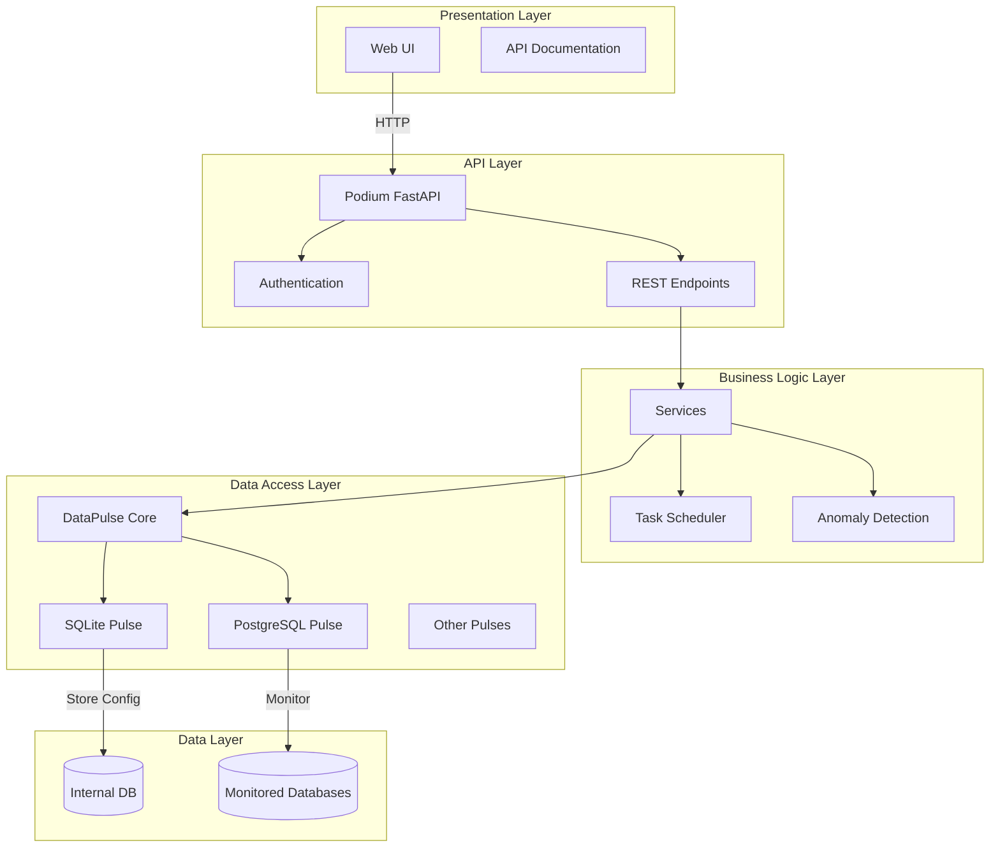
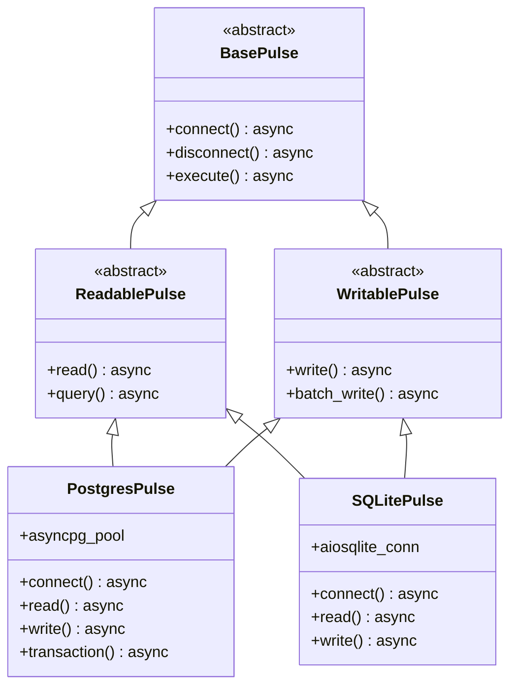
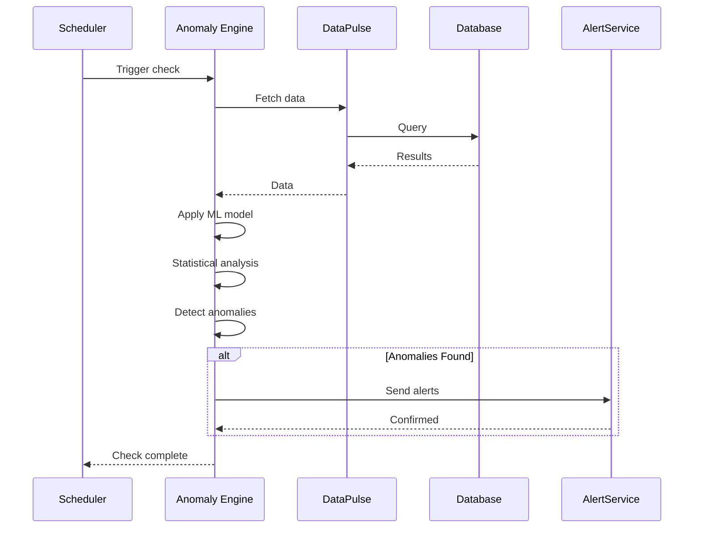
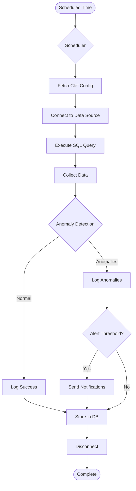
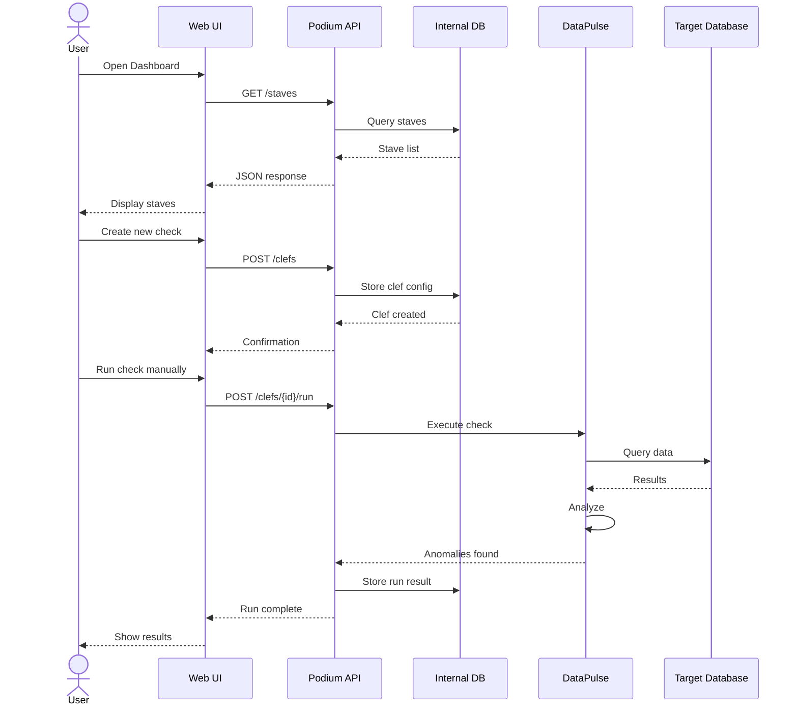
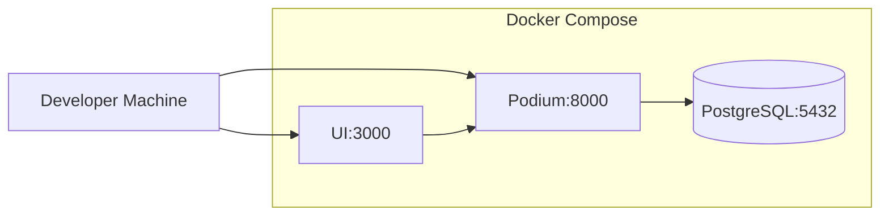
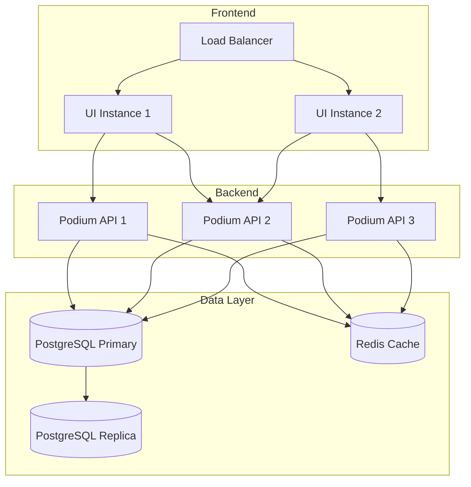
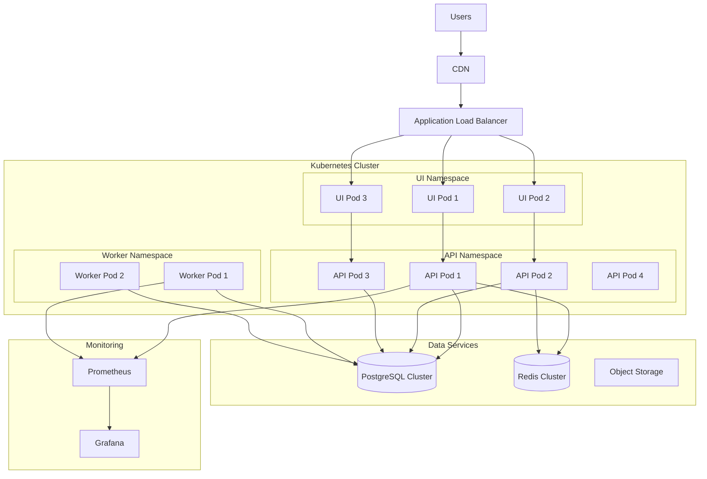
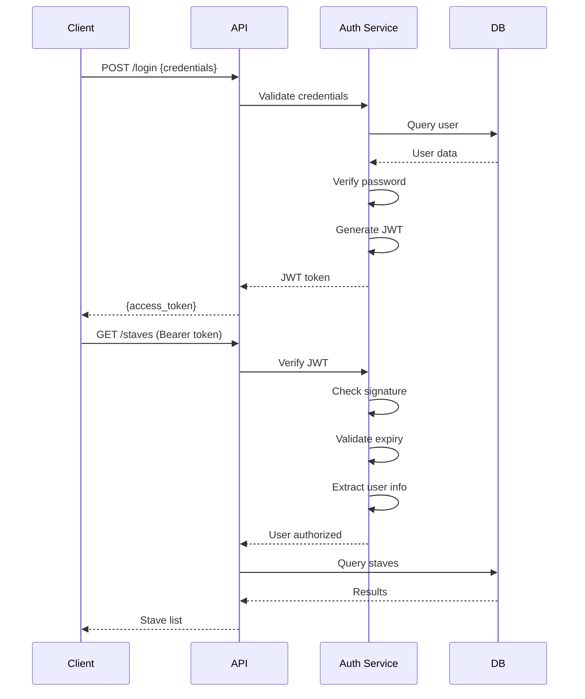

# 🏗️ DataMetronome Architecture

This document provides a comprehensive overview of DataMetronome's system architecture, design principles, and component interactions.

---

## Table of Contents

- [System Overview](#system-overview)
- [Core Components](#core-components)
- [Data Flow](#data-flow)
- [Technology Stack](#technology-stack)
- [Design Principles](#design-principles)
- [Deployment Architecture](#deployment-architecture)

---

## System Overview

DataMetronome follows a modular, layered architecture designed for scalability, performance, and extensibility.



### Key Characteristics

- **Async-First**: Built on asyncio for high-performance, non-blocking I/O
- **Modular Design**: Independent components that can be deployed separately
- **Plugin Architecture**: Extensible through DataPulse connectors
- **API-Driven**: All functionality accessible via REST API
- **Stateless Services**: Horizontally scalable without session affinity

---

## Core Components

### 1. DataPulse Connectors

**Purpose**: High-performance, async database connectivity layer

**Key Features**:
- Abstract base interfaces for consistency
- Multiple database implementations (PostgreSQL, SQLite, more coming)
- Connection pooling and optimization
- Transaction support
- Query building utilities

**Component Diagram**:



**Variants**:
- **asyncpg** - Pure asyncpg implementation (fastest for PostgreSQL)
- **psycopg3** - Modern psycopg3 async implementation
- **SQLAlchemy** - ORM-based for complex queries
- **SQLite** - Lightweight local storage

### 2. Podium API

**Purpose**: Central REST API for all DataMetronome operations

**Technology**: FastAPI with Pydantic for validation

**Endpoints**:
```
/api/v1/
├── auth/          # Authentication
├── staves/        # Data sources
├── clefs/         # Data quality checks
├── check-runs/    # Execution history
└── users/         # User management
```

**Key Features**:
- JWT-based authentication
- Automatic API documentation (Swagger/ReDoc)
- Request validation with Pydantic
- Async request handling
- Role-based access control

### 3. UI

**Purpose**: Interactive dashboard for visualization and monitoring

**Features**:
- Real-time data quality monitoring with shared UI components
- ML-powered anomaly detection overlays
- Interactive visualizations (Chart.js + Vue Chart.js)
- Custom API-driven exploration flows
- Data profiling tools and clef configuration forms

**Tabs**:
1. **Overview** - System health and metrics
2. **Anomalies** - Detected issues
3. **ML Anomalies** - Machine learning insights
4. **Trends & Patterns** - Time series analysis
5. **Investigation** - Ad-hoc exploration

### 4. Anomaly Detection Engine

**Purpose**: Identify data quality issues and outliers

**Algorithms**:
- **Isolation Forest** - Statistical outlier detection
- **Statistical Tests** - Z-score, IQR-based detection
- **Rule-Based** - Custom thresholds and patterns
- **Coming Soon**: LSTM, One-Class SVM, Autoencoders

**Process Flow**:



### 5. Task Scheduler

**Purpose**: Execute scheduled data quality checks

**Technology**: APScheduler (async-compatible)

**Features**:
- Cron-style scheduling
- Job persistence
- Retry logic
- Concurrent execution limits
- Job monitoring

---

## Data Flow

### Check Execution Flow



### User Interaction Flow



---

## Technology Stack

### Languages & Frameworks

| Component | Technology | Version | Purpose |
|-----------|-----------|---------|---------|
| Backend | Python | 3.11+ | Core language |
| API Framework | FastAPI | 0.104+ | REST API |
| UI Framework | Web UI (SPA) | — | Dashboard |
| Data Validation | Pydantic | 2.5+ | Schema validation |
| ML | scikit-learn | 1.3+ | Anomaly detection |
| Async Runtime | asyncio | Built-in | Async operations |

### Databases

| Type | Technology | Use Case |
|------|-----------|----------|
| Internal Storage | SQLite | Configuration & state |
| Production Option | PostgreSQL | Scalable storage |
| Monitored Databases | PostgreSQL | Data quality monitoring |
| Coming Soon | MySQL, MongoDB | Multi-database support |

### Infrastructure

| Component | Technology | Purpose |
|-----------|-----------|---------|
| Containerization | Docker | Deployment |
| Orchestration | Docker Compose | Local dev |
| Orchestration (Prod) | Kubernetes | Production |
| CI/CD | GitHub Actions | Automated testing |
| Package Management | uv/pip | Dependencies |

### Database Drivers

| Driver | Performance | Use Case |
|--------|------------|----------|
| asyncpg | ⚡⚡⚡ Fastest | High-throughput PostgreSQL |
| psycopg3 | ⚡⚡ Fast | Modern PostgreSQL |
| SQLAlchemy | ⚡ Flexible | ORM, complex queries |
| aiosqlite | ⚡ Lightweight | SQLite async |

---

## Design Principles

### 1. **Async-First Architecture**

All I/O operations use async/await for maximum throughput:

```python
# Good: Async operations
async def process_checks():
    tasks = [run_check(check) for check in checks]
    results = await asyncio.gather(*tasks)
    return results

# Avoid: Synchronous blocking
def process_checks_sync():
    results = []
    for check in checks:
        result = run_check_sync(check)  # Blocks!
        results.append(result)
    return results
```

### 2. **Separation of Concerns**

Each layer has a clear responsibility:

- **Presentation**: UI/UX only
- **API**: HTTP handling and validation
- **Business Logic**: Core functionality
- **Data Access**: Database operations
- **Data**: Persistent storage

### 3. **Dependency Injection**

Services receive dependencies rather than creating them:

```python
# Good: Injected dependency
class CheckService:
    def __init__(self, pulse_connector: BasePulse):
        self.pulse = pulse_connector

# Avoid: Creating dependencies
class CheckService:
    def __init__(self):
        self.pulse = PostgresPulse(...)  # Tightly coupled
```

### 4. **Interface-Based Design**

DataPulse connectors implement consistent interfaces:

```python
class BasePulse(ABC):
    @abstractmethod
    async def connect(self) -> None: ...

    @abstractmethod
    async def disconnect(self) -> None: ...

    @abstractmethod
    async def execute(self, query: str) -> Any: ...
```

### 5. **Fail-Fast Validation**

Use Pydantic for early validation:

```python
class ClefCreate(BaseModel):
    name: str = Field(..., min_length=1, max_length=255)
    type: str = Field(..., pattern="^(null_check|range_check|custom)$")
    config: dict[str, Any]
    schedule: str = Field(..., pattern="^(@(annually|yearly|monthly|weekly|daily|hourly)|(\d+\s+){4,5}\d+)$")
```

### 6. **Graceful Degradation**

System continues operating even if components fail:

- UI works without API (shows cached data)
- Checks continue even if alerting fails
- Individual check failures don't affect others

---

## Deployment Architecture

### Development Environment



### Production Environment (Small Scale)



### Production Environment (Enterprise Scale)



---

## Security Architecture

### Authentication & Authorization



### Data Security Layers

1. **Transport Security**: HTTPS/TLS for all connections
2. **Authentication**: JWT tokens with expiry
3. **Authorization**: Role-based access control (RBAC)
4. **Data Encryption**: Encryption at rest (optional)
5. **Secrets Management**: Environment variables, vault integration
6. **Audit Logging**: All operations logged

---

## Scalability Considerations

### Horizontal Scaling

| Component | Scaling Strategy | Considerations |
|-----------|-----------------|----------------|
| UI | Multiple instances behind LB | Session state in Redis |
| Podium API | Multiple instances (stateless) | Easy to scale |
| Database | Read replicas, sharding | Most critical bottleneck |
| Workers | Thread pool executor (APScheduler) | For concurrent check execution |

### Performance Optimization

1. **Connection Pooling**: Reuse database connections
2. **Query Optimization**: Indexes, query planning
3. **Caching**: Redis for frequently accessed data
4. **Async I/O**: Non-blocking operations
5. **Batch Processing**: Group operations

---

## Future Architecture Enhancements

### Roadmap Items

**Q4 2024:**
- Prometheus metrics integration
- Health check endpoints
- Advanced reporting module

**Q1 2025:**
- Real-time streaming with WebSockets
- In-process scheduler (APScheduler) - **Current implementation**
- Distributed task queue (Celery) - **Not needed currently, future option if scaling requires it**
- Alert service with multiple channels

**Q2 2025:**
- Plugin system architecture
- Multi-database federation
- Advanced caching layer

**Q3 2025:**
- Multi-tenancy support
- Microservices decomposition
- Event-driven architecture

---

## Further Reading

- [Quick Start Guide](quickstart.md)
- [API Reference](api.md)
- [Development Guide](development.md)
- [Deployment Guide](../DEPLOYMENT.md)

---

**Last Updated**: October 2024
**Architecture Version**: 1.0
