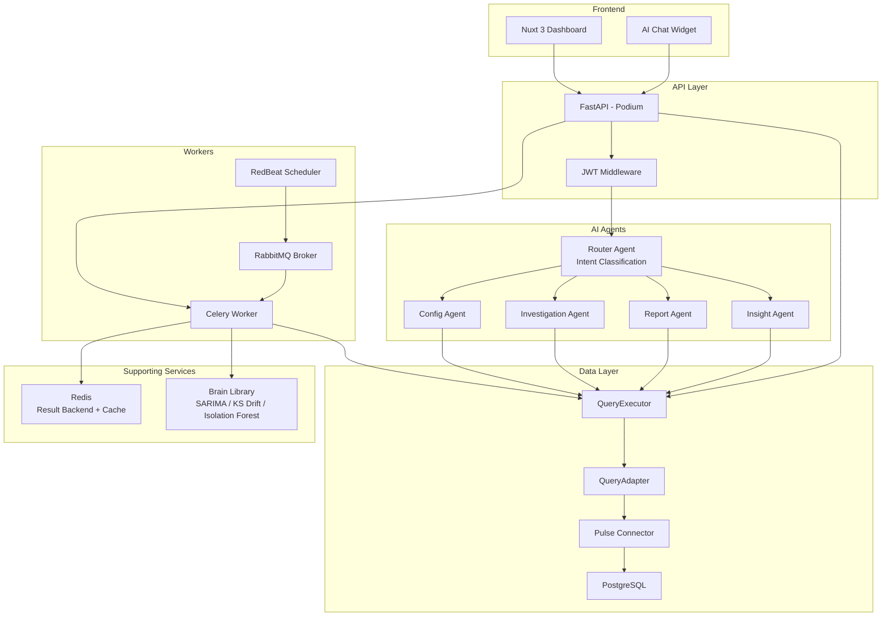
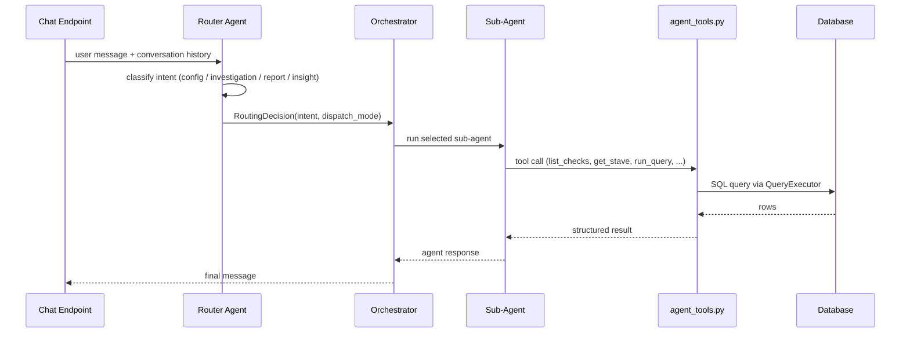
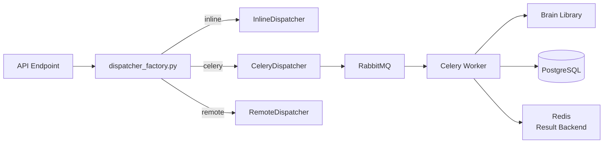

# DataMetronome Architecture

A technical reference for contributors and AI agents. Covers system topology,
request flow, AI agent design, feature slice conventions, database access layers,
and worker architecture.

See also: [docs/architecture/worker-architecture.md](architecture/worker-architecture.md)
for the detailed Celery worker design.

---

## Table of Contents

- [System Overview](#system-overview)
- [Request Flow](#request-flow)
- [AI Agent Architecture](#ai-agent-architecture)
- [Feature Slice Pattern](#feature-slice-pattern)
- [Database Access Layers](#database-access-layers)
- [Worker Architecture](#worker-architecture)
- [Key Source Locations](#key-source-locations)

---

## System Overview



### Key characteristics

- **Async-first** -- built on `asyncio`, `asyncpg`, and `aiosqlite` for non-blocking I/O
- **Feature-slice architecture** -- each domain owns its model, repo, router, and schema
- **Database-agnostic** -- identical code runs on SQLite (development) and PostgreSQL (production)
- **Multi-agent AI** -- Pydantic AI agents with structured routing, tool calling, and workflow checkpoints
- **Decoupled check execution** -- `CheckDispatcher` protocol with pluggable backends (inline, Celery, remote)

---

## Request Flow

A typical authenticated API request travels through the following layers:

```
HTTP Request
    |
    v
FastAPI router  (features/{name}/router.py)
    |
    v
get_current_user()  -- validates JWT, raises 401 if missing or expired
    |
    v
Endpoint handler  -- validates request schema, calls repo
    |
    v
Repository function  (features/{name}/repo.py)
    |
    v
get_executor()  -- returns the global QueryExecutor bound to the app DB connection
    |
    v
QueryExecutor.query() / .execute() / .execute_returning()
    |
    v
QueryAdapter.adapt()  -- rewrites ? -> $1,$2,... for PostgreSQL; no-op for SQLite
    |
    v
Pulse connector  -- asyncpg/psycopg3/sqlalchemy (PostgreSQL), aiosqlite (SQLite), or bigquery
    |
    v
Database
```

**Auth is enforced at endpoint level** via `Depends(get_current_user)`. Public
endpoints (e.g., `/health`, `/api/v1/auth/login`) opt out explicitly.

**All SQL uses `?` placeholders.** `QueryAdapter` handles dialect translation at
runtime so no application code branches on database type.

**`quote_identifier()` wraps every dynamic table or column name** in double-quotes
to prevent SQL injection via config-driven or user-provided identifiers.

---

## AI Agent Architecture

All agent interaction enters through the chat endpoint
(`features/chat/router.py`). Agents are built with Pydantic AI.



### Agent responsibilities

| Agent | Intent | Typical tools |
|---|---|---|
| Router Agent | Classify user intent | (reasoning only -- no DB tools) |
| Config Agent | Create / edit staves and clefs | get_stave, create_clef, update_stave |
| Investigation Agent | Diagnose failures | list_checks, get_quality_report, get_stave |
| Report Agent | Summarise metrics | get_quality_report, list_checks, get_stave |
| Insight Agent | Surface data intelligence | domain classification, insight queries |

### Agent tools

All tools live in `services/agent_tools.py`. They use `get_executor()` to obtain a
`QueryExecutor` and return structured data to the calling agent.

### Dispatch modes

The orchestrator supports three dispatch modes controlled by `RoutingDecision`:

- **single** -- one agent runs and returns
- **chain** -- agents run sequentially, each receiving the previous result
- **parallel** -- multiple agents run concurrently and results are merged

---

## Feature Slice Pattern

Each business domain has a self-contained slice under `features/{name}/`:

```
features/
  analytics/    -- analytics events
  auth/         -- login, register, /me (public endpoints)
  staves/
    model.py    -- Python dataclass/Pydantic model mirroring the DB row
    repo.py     -- All SQL for this domain, via QueryExecutor
    schema.py   -- API request/response schemas (validation + serialization)
    router.py   -- FastAPI APIRouter, mounted at /api/v1/{name}/
  clefs/
    model.py, repo.py, schema.py, router.py
  checks/   ...
  chat/     ...
  insights/ ...
  metrics/  ...
  reports/  ...
  traces/   ...
  trends/   ...
  users/    ...
  user_memory/ ...
  workflows/ ...
```

All API endpoints live in `features/*/router.py`. There is no `api/v1/endpoints/` directory.

### Authorization

Roles: `admin` (full access), `editor` (read + write), `viewer` (read-only).

```python
from datametronome_podium.core.auth import get_current_user, require_editor, require_admin

# Read-only endpoint — any authenticated user
@router.get("/items")
async def list_items(user: dict = Depends(get_current_user)): ...

# Write endpoint — editor or admin
@router.post("/items")
async def create_item(user: dict = Depends(require_editor)): ...

# Admin-only endpoint
@router.delete("/items/{id}")
async def delete_item(user: dict = Depends(require_admin)): ...
```

### model.py

Holds Pydantic models that mirror DB columns. Used to carry data between repo
and endpoint without passing raw dicts.

```python
# features/staves/model.py
class Stave(BaseModel):
    id: str
    name: str
    data_source_type: str
    connection_config: dict
    is_active: bool
    created_at: datetime
```

### repo.py

All SQL for a feature lives here. No SQL appears in routers or services.
Always receives a `QueryExecutor` from `get_executor()` -- never `get_db()`.

```python
# features/staves/repo.py
async def get_stave(executor: QueryExecutor, stave_id: str) -> Stave | None:
    rows = await executor.query(
        'SELECT * FROM "staves" WHERE "id" = ?', [stave_id]
    )
    return Stave(**rows[0]) if rows else None
```

### schema.py

Pydantic models for HTTP request bodies and response payloads. Separate from
`model.py` to decouple the DB shape from the API contract.

### router.py

FastAPI `APIRouter` with `Depends(get_current_user)` on every route. Calls repo
functions. Contains no SQL and no business logic.

### Why this separation

- **Testability** -- repos are tested directly against an in-memory SQLite executor
- **No coupling** -- routers never import models directly; schemas never import repos
- **Discoverability** -- every feature follows the same four-file layout

---

## Database Access Layers

```
Application code  (repos, services)
    |
    v  SQL with ? placeholders
QueryExecutor           core/query.py
    |  query(), execute(), insert(), transaction()
    v
QueryAdapter            core/query_adapter.py
    |  ? -> $1,$2,... (PostgreSQL)
    |  bool -> 1/0    (SQLite)
    v
Pulse connector         datametronome/pulse/
    |  asyncpg (PostgreSQL) or aiosqlite (SQLite)
    v
Database
```

### QueryAdapter

`QueryAdapter` is constructed with a dialect string (`"sqlite"` or
`"postgresql"`) at startup and translates all SQL before it reaches the driver.

- **PostgreSQL**: rewrites `?` -> `$1`, `$2`, ... (positional numbered parameters)
- **SQLite**: converts `bool` params to `1`/`0` (SQLite has no native boolean)
- **DDL**: translates `JSONB` -> `TEXT` and `DOUBLE PRECISION` -> `REAL` for SQLite

### quote_identifier()

Every dynamic identifier (table name, column name from config or user input) must
be wrapped with `quote_identifier()` from `core/query.py`. This prevents SQL
injection when identifiers come from YAML configs or API payloads.

```python
from datametronome_podium.core.query import quote_identifier

table = quote_identifier(stave.table_name)  # -> '"my_table"'
col   = quote_identifier(column_name)       # -> '"email"'
sql   = f'SELECT COUNT(*) FROM {table} WHERE {col} IS NULL'
```

### QueryExecutor API

```python
# Core operations
await executor.query(sql, params)            # SELECT -> list[dict]
await executor.execute(sql, params)          # INSERT/UPDATE/DELETE -> rows affected
await executor.execute_returning(sql, params) # INSERT ... RETURNING -> list[dict]
await executor.execute_ddl(sql)              # DDL with type translation

# Convenience helpers
await executor.select(table, columns, where, order_by, limit, offset)
await executor.insert(table, data_dict)
await executor.update(table, data_dict, where)
await executor.delete(table, where)

# Transactions
async with executor.transaction():
    await executor.insert("checks", check_data)
    await executor.update("clefs", {"last_run": now}, {"id": clef_id})
```

### Pattern

All application code uses `get_executor()`. **New code must always use
`get_executor()`.** Never call `get_db()` or `execute_query()` (both removed).

---

## Worker Architecture

Check execution is dispatched via the `CheckDispatcher` protocol. Three
implementations are selected by `DATAMETRONOME_DISPATCH_MODE`:

| Mode | Class | Use case |
|---|---|---|
| `inline` | `InlineDispatcher` | Development / tests -- synchronous |
| `celery` | `CeleryDispatcher` | Production -- sends task to RabbitMQ |
| `remote` | `RemoteDispatcher` | Future: HTTP dispatch to external runner |



### Celery queues

Three queues with separate priority routing:

| Queue | Purpose |
|---|---|
| `checks.high` | User-triggered "Run Now" -- low latency |
| `checks.default` | Scheduled clef execution |
| `checks.bulk` | Batch import or bulk operations |

### Worker DB access

Workers run in a separate process and cannot use the global `get_executor()`
singleton (it is bound to the FastAPI lifespan). Workers must use
`worker_db_session()` from `core/worker_db.py`:

```python
from datametronome_podium.core.worker_db import worker_db_session

async with worker_db_session() as executor:
    await repo.save_check_result(executor, result)
```

### Scheduling

`RedBeat` (celery-redbeat) stores schedules in Redis and fires periodic tasks.
The Celery Beat process runs as a dedicated container. Schedules are updated
atomically when clefs are created or modified via the API. Beat runs as a
singleton to prevent duplicate execution across replicas.

---

## Key Source Locations

| Concept | Path |
|---|---|
| Settings / env vars | `datametronome_podium/core/config.py` |
| QueryExecutor | `datametronome_podium/core/query.py` |
| QueryAdapter | `datametronome_podium/core/query_adapter.py` |
| DB connection setup | `datametronome_podium/core/database.py` |
| Worker DB session | `datametronome_podium/core/worker_db.py` |
| Celery app | `datametronome_podium/core/celery_app.py` |
| CheckDispatcher protocol | `datametronome_podium/core/check_dispatcher.py` |
| Dispatcher factory | `datametronome_podium/core/dispatcher_factory.py` |
| Agent tools | `datametronome_podium/services/agents/agent_tools.py` |
| Orchestrator | `datametronome_podium/services/orchestrator.py` |
| Feature slices | `datametronome_podium/features/{name}/` |
| Auth utilities | `datametronome_podium/core/auth.py` |
| Celery tasks | `datametronome_podium/tasks/` |
| Alembic migrations | `datametronome/podium/alembic/` |
| Worker architecture detail | `docs/architecture/worker-architecture.md` |
