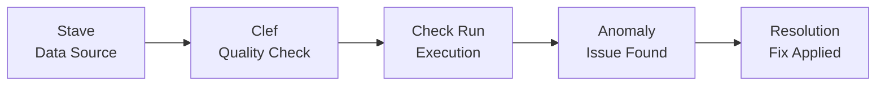

# 🎵 DataMetronome Concepts & Terminology

Understanding DataMetronome's musical metaphor and core concepts.

---

## 🎼 The Musical Metaphor

DataMetronome uses musical terminology to make data quality monitoring more intuitive and memorable.

### Why Music?

- **Data flows like music** - rhythmic, patterns, harmonies
- **Quality monitoring is like conducting** - keeping everything in tempo
- **Anomalies are like wrong notes** - detectable disruptions in the pattern

---

## Core Concepts

### 🎼 Stave (Staff)

**Definition**: A **stave** is a **data source** that you want to monitor.

**Musical Metaphor**: In music, a staff (or stave) is the set of five horizontal lines on which musical notes are written. Similarly, in DataMetronome, a stave is the foundation where your data "notes" (records) exist.

**Technical Definition**:
- A configured connection to a database or data system
- Contains connection parameters (host, port, credentials)
- Can be active or inactive
- Supports multiple database types (PostgreSQL, MySQL, MongoDB, etc.)

**Example**:
```json
{
  "id": "stave-001",
  "name": "Production User Database",
  "data_source_type": "postgres",
  "connection_config": {
    "host": "prod-db.example.com",
    "port": 5432,
    "database": "users",
    "user": "monitor_user"
  },
  "is_active": true
}
```

**Real-World Analogy**: Think of a stave like a "music sheet" for one instrument in your data orchestra.

---

### 🎵 Clef

**Definition**: A **clef** is a **data quality check** that runs on a stave.

**Musical Metaphor**: In music, a clef is a symbol placed at the beginning of a staff to indicate the pitch of the notes. In DataMetronome, a clef "reads" your data and determines if it's in the right "key" (quality).

**Technical Definition**:
- A configured data quality rule or check
- Runs against a specific stave (data source)
- Can be scheduled or run on-demand
- Detects anomalies, null values, duplicates, etc.

**Check Types**:
- `null_check` - Find NULL values in columns
- `uniqueness_check` - Find duplicate values
- `range_check` - Find values outside expected range
- `pattern_check` - Match against regex patterns
- `freshness_check` - Check data recency
- `volume_check` - Monitor row counts
- `custom_sql` - Custom SQL queries

**Example**:
```json
{
  "id": "clef-001",
  "stave_id": "stave-001",
  "name": "Check for NULL emails",
  "check_type": "null_check",
  "config": {
    "table": "users",
    "column": "email",
    "threshold": 0.01
  },
  "schedule": "0 * * * *",
  "is_active": true
}
```

**Real-World Analogy**: A clef is like a "quality inspector" that regularly checks one aspect of your data.

---

### 📊 Check (Check Run)

**Definition**: A **check** is a **single execution** of a clef.

**Musical Metaphor**: Each time you play a piece of music, it's a performance. Each time a clef runs, it's a check.

**Technical Definition**:
- The result of running a clef at a specific time
- Contains execution status (success, failed, error)
- Records anomalies found
- Tracks execution time and metadata

**Example**:
```json
{
  "id": "check-run-12345",
  "clef_id": "clef-001",
  "stave_id": "stave-001",
  "status": "success",
  "timestamp": "2024-10-03T10:00:00Z",
  "execution_time": 2.5,
  "anomalies_count": 3,
  "message": "Found 3 NULL email addresses"
}
```

---

### 🚨 Anomaly

**Definition**: An **anomaly** is a **data quality issue** detected by a check.

**Musical Metaphor**: A wrong note or off-tempo beat in the music.

**Technical Definition**:
- A record that violates the quality rule
- Has severity level (low, medium, high, critical)
- Can be acknowledged or resolved
- Links back to the check that found it

**Example**:
```json
{
  "id": "anomaly-789",
  "check_id": "check-run-12345",
  "table_name": "users",
  "column_name": "email",
  "anomaly_type": "null_value",
  "severity": "high",
  "detected_at": "2024-10-03T10:00:00Z",
  "data_sample": "user_id: 12345, email: NULL",
  "resolution_status": "investigating"
}
```

---

## 🔄 Complete Workflow

Here's how all concepts work together:

```
1. Create a STAVE (data source)
   └── Configure connection to your database

2. Create CLEFs (quality checks) on the stave
   └── Define what to check and when

3. CLEFs run automatically or manually
   └── Creates CHECK RUNS with results

4. Anomalies are detected and recorded
   └── You investigate and resolve issues
```

**Visual Flow**:



---

## 📖 Terminology Quick Reference

| Term | What It Is | Musical Origin | Example |
|------|------------|----------------|---------|
| **Stave** | Data source connection | Staff (lines for notes) | Production PostgreSQL DB |
| **Clef** | Data quality check | Clef (pitch indicator) | NULL email validator |
| **Check** | Single execution of a clef | Performance | Run at 10:00 AM |
| **Anomaly** | Data quality issue | Wrong note | NULL value found |
| **Metronome** | The platform itself | Tempo keeper | Keeps data "in tempo" |

---

## 💡 Why This Naming?

**Traditional naming** would be:
- Data source → "Connection" or "Database"
- Quality check → "Validator" or "Rule"
- Execution → "Job" or "Run"

**DataMetronome naming** makes it:
- ✅ **Memorable** - Unique terms stick in your mind
- ✅ **Consistent** - All musical terminology
- ✅ **Fun** - Makes data quality less dry
- ✅ **Brandable** - Distinguishes from competitors

---

## 🎯 Real-World Example

**Scenario**: You want to monitor your e-commerce database

```python
# 1. Create a STAVE (your production database)
stave = {
    "name": "E-commerce Production DB",
    "type": "postgres",
    "config": {"host": "prod-db.com", "database": "ecommerce"}
}

# 2. Create CLEFs (quality checks)
clefs = [
    {
        "name": "Ensure all orders have valid amounts",
        "check_type": "range_check",
        "config": {"table": "orders", "column": "amount", "min": 0}
    },
    {
        "name": "Check for duplicate order IDs",
        "check_type": "uniqueness_check",
        "config": {"table": "orders", "column": "order_id"}
    }
]

# 3. Checks run automatically every hour
# 4. When anomalies are found, you get alerted
# 5. View all results in the dashboard
```

---

## 🤔 Common Questions

**Q: Why not just call them "data sources" and "checks"?**
A: We do in plain English, but the musical terminology creates a cohesive, memorable brand.

**Q: Do I need to understand music to use DataMetronome?**
A: Not at all! The metaphor is just for naming. The functionality is straightforward data quality monitoring.

**Q: Can I use different terminology?**
A: The API accepts these terms, but you can think of them however makes sense to you.

---

## 📚 Further Reading

- [Quick Start Guide](quickstart.md) - Get started in 5 minutes
- [API Reference](api.md) - Complete API documentation
- [Architecture](architecture.md) - System design
- [Development Guide](development.md) - Contributing

---

**🎵 Now you're ready to conduct your data orchestra!**
