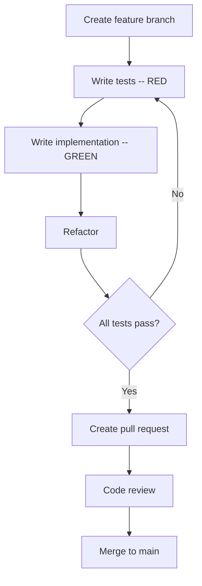

# Development Guide

This guide covers the project structure, testing, database migrations, and contribution workflow for DataMetronome.

---

## Project Structure

```
datametronome/
├── datametronome/
│   ├── brain/                  # AI agent layer
│   │   ├── base/               #   Core agent abstractions
│   │   └── advanced/           #   Advanced agent capabilities
│   ├── pulse/                  # Database connector layer
│   │   ├── core/               #   PulseProtocol + shared interfaces
│   │   ├── sqlite/             #   SQLite connector
│   │   ├── postgres/           #   PostgreSQL connector (asyncpg)
│   │   ├── postgres-psycopg3/  #   PostgreSQL connector (psycopg3)
│   │   ├── postgres-sqlalchemy/#   PostgreSQL connector (SQLAlchemy)
│   │   ├── bigquery/           #   BigQuery connector
│   │   └── api/                #   API-based connector
│   ├── podium/                 # FastAPI backend (main application)
│   │   ├── datametronome_podium/
│   │   │   ├── api/            #   API routes (v1 endpoints)
│   │   │   ├── core/           #   Database, config, security
│   │   │   ├── features/       #   Feature slices (see below)
│   │   │   ├── models/         #   SQLAlchemy models
│   │   │   ├── services/       #   Business logic services
│   │   │   └── main.py         #   Application entry point
│   │   ├── alembic/            #   Database migrations
│   │   └── tests/              #   Test suite (274 tests)
│   ├── plugins/                # Plugin system
│   └── docs/                   # Internal documentation
├── ui-nuxt/                    # Nuxt 3 frontend
├── docs/                       # Project documentation
├── docker-compose.yml          # Container orchestration
├── Makefile                    # Development shortcuts
└── env.example                 # Environment variable template
```

### Feature Slices

The backend follows a feature-slice architecture. Each feature is a self-contained module under `datametronome/podium/datametronome_podium/features/`:

```
features/
├── analytics/     # Metrics, trends, reports
├── chat/          # AI chat conversations
├── checks/        # Data quality check results
├── clefs/         # Check definitions (what to check)
├── scheduler/     # Scheduled job management
├── staves/        # Data source connections
├── traces/        # AI agent execution traces
├── users/         # User management
└── workflows/     # Multi-step workflow definitions
```

Each feature slice contains:

| File | Purpose |
| ---- | ------- |
| `model.py` | SQLAlchemy model definition |
| `repo.py` | Repository (all database queries) |
| `schema.py` | Pydantic schemas for request/response |
| `router.py` | FastAPI router (if the feature exposes API endpoints) |

---

## Development Environment Setup

### Option 1: Docker (Recommended)

```bash
# Create .env from template
cp env.example .env

# Start API + PostgreSQL
docker compose up -d

# Start with UI as well
docker compose --profile full up -d
```

Source code is bind-mounted into containers, so edits on your machine are picked up immediately with auto-reload.

### Option 2: Local Development

**Prerequisites:** Python 3.13+, Node.js 20+, PostgreSQL 15+ (or use Docker for the database only)

```bash
# Start PostgreSQL via Docker
docker compose up -d postgres

# Create virtual environment
cd datametronome/podium
python3.13 -m venv .venv
source .venv/bin/activate

# Install all packages (from repo root)
cd ../..
.venv/bin/pip install -e ./datametronome/pulse/core \
                      -e ./datametronome/pulse/sqlite \
                      -e ./datametronome/pulse/postgres \
                      -e ./datametronome/brain/base \
                      -e ./datametronome/podium

# Install dev dependencies
.venv/bin/pip install pytest pytest-asyncio pytest-timeout black isort mypy

# Run database migrations
cd datametronome/podium
DATABASE_URL="${DATAMETRONOME_DATABASE_URL}" alembic upgrade head

# Start the API
cd ../..
.venv/bin/python -m datametronome_podium.main
```

**Frontend:**

```bash
cd ui-nuxt
npm install
NUXT_PUBLIC_API_BASE=http://localhost:8001/api/v1 \
NUXT_PUBLIC_PODIUM_API_BASE=http://localhost:8001 \
npm run dev
```

---

## Running Tests

The test suite uses pytest with strict async mode. Always run from `datametronome/podium`:

```bash
cd datametronome/podium

# Run all tests
.venv/bin/python -m pytest tests/ -v --timeout=10

# Run a specific test file
.venv/bin/python -m pytest tests/test_staves.py -v --timeout=10

# Run tests matching a keyword
.venv/bin/python -m pytest tests/ -k "test_chat" -v --timeout=10

# With coverage
.venv/bin/python -m pytest tests/ --cov=datametronome_podium --cov-report=term-missing
```

Key details:
- **asyncio mode:** strict -- async tests require `@pytest.mark.asyncio`
- **Timeout:** use `--timeout=10` to catch hanging tests
- **Current count:** 274 tests

---

## Docker Development

### Rebuilding After Changes

Most code changes are picked up automatically via bind mounts. Rebuild when you change dependencies or Dockerfiles:

```bash
# Rebuild all images
docker compose build

# Rebuild only the API
docker compose build podium

# Rebuild the UI (after package.json changes)
docker compose build ui

# Restart with fresh builds
docker compose up -d --build
```

### Viewing Logs

```bash
# All services
docker compose logs -f

# Single service
docker compose logs -f podium

# Last 100 lines
docker compose logs --tail=100 podium
```

### Accessing the Database

```bash
docker compose exec postgres psql -U testuser -d datametronome_test
```

---

## Database Migrations

DataMetronome uses [Alembic](https://alembic.sqlalchemy.org/) for schema migrations. Migration files live in `datametronome/podium/alembic/versions/`.

### Running Migrations

```bash
cd datametronome/podium

# Apply all pending migrations
DATABASE_URL="${DATAMETRONOME_DATABASE_URL}" alembic upgrade head

# Check current migration state
DATABASE_URL="${DATAMETRONOME_DATABASE_URL}" alembic current

# View migration history
DATABASE_URL="${DATAMETRONOME_DATABASE_URL}" alembic history
```

### Creating a New Migration

```bash
cd datametronome/podium

# Auto-generate from model changes
DATABASE_URL="${DATAMETRONOME_DATABASE_URL}" alembic revision --autogenerate -m "add_new_column"

# Create an empty migration for manual SQL
DATABASE_URL="${DATAMETRONOME_DATABASE_URL}" alembic revision -m "custom_migration"
```

In Docker, migrations run automatically on container startup (see the Podium Dockerfile `CMD`).

---

## Adding a New Feature Slice

Follow this pattern to add a new feature to the backend.

### 1. Create the feature directory

```bash
mkdir datametronome/podium/datametronome_podium/features/my_feature
touch datametronome/podium/datametronome_podium/features/my_feature/__init__.py
```

### 2. Define the model (`model.py`)

```python
from sqlalchemy import Column, Integer, String, DateTime
from sqlalchemy.sql import func
from datametronome_podium.core.database import Base

class MyFeature(Base):
    __tablename__ = "my_features"

    id = Column(Integer, primary_key=True, index=True)
    name = Column(String, nullable=False)
    created_at = Column(DateTime, server_default=func.now())
```

### 3. Define schemas (`schema.py`)

```python
from pydantic import BaseModel
from datetime import datetime

class MyFeatureCreate(BaseModel):
    name: str

class MyFeatureRead(BaseModel):
    id: int
    name: str
    created_at: datetime

    model_config = {"from_attributes": True}
```

### 4. Create the repository (`repo.py`)

```python
from sqlalchemy import select
from sqlalchemy.ext.asyncio import AsyncSession
from .model import MyFeature
from .schema import MyFeatureCreate

class MyFeatureRepo:
    def __init__(self, session: AsyncSession):
        self.session = session

    async def create(self, data: MyFeatureCreate) -> MyFeature:
        obj = MyFeature(**data.model_dump())
        self.session.add(obj)
        await self.session.flush()
        return obj

    async def get_by_id(self, feature_id: int) -> MyFeature | None:
        result = await self.session.execute(
            select(MyFeature).where(MyFeature.id == feature_id)
        )
        return result.scalar_one_or_none()
```

### 5. Add the router (`router.py`)

```python
from fastapi import APIRouter, Depends
from sqlalchemy.ext.asyncio import AsyncSession
from datametronome_podium.core.database import get_session
from .repo import MyFeatureRepo
from .schema import MyFeatureCreate, MyFeatureRead

router = APIRouter(prefix="/my-features", tags=["my-features"])

@router.post("/", response_model=MyFeatureRead)
async def create(data: MyFeatureCreate, session: AsyncSession = Depends(get_session)):
    repo = MyFeatureRepo(session)
    obj = await repo.create(data)
    await session.commit()
    return obj
```

### 6. Register the router

Wire the new router into the application by importing it in the API layer and including it on the FastAPI app.

### 7. Create a migration

```bash
cd datametronome/podium
DATABASE_URL="${DATAMETRONOME_DATABASE_URL}" alembic revision --autogenerate -m "add_my_feature_table"
```

---

## Development Workflow



### Branch Naming

- `feat/description` -- new features
- `fix/description` -- bug fixes
- `docs/description` -- documentation changes
- `refactor/description` -- code improvements

### Commit Message Format

- `feat:` -- new feature
- `fix:` -- bug fix
- `docs:` -- documentation changes
- `test:` -- adding or updating tests
- `refactor:` -- code refactoring
- `perf:` -- performance improvement
- `chore:` -- maintenance tasks

### Code Style

- **Python:** Format with `black`, sort imports with `isort`, type-check with `mypy`
- **TypeScript/Vue:** Follow Nuxt conventions
- Use built-in type hints (`list[str]` not `List[str]`)

```bash
# Format code
make format

# Check linting
make lint
```

---

## Contributing

### Pull Request Process

1. Fork the repository
2. Create a feature branch from `main`
3. Make your changes with tests
4. Run the full test suite
5. Update documentation as needed
6. Submit a PR with a clear description

### PR Checklist

- [ ] Tests pass (`.venv/bin/python -m pytest tests/ -v --timeout=10`)
- [ ] Code formatted (`black datametronome/`)
- [ ] Imports sorted (`isort datametronome/`)
- [ ] Type hints added for new code
- [ ] Documentation updated if needed
- [ ] Commit messages follow convention

---

## Useful Make Commands

```bash
make help           # List all commands
make test           # Run tests
make lint           # Check code style
make format         # Auto-format code
make clean          # Remove build artifacts
make docker-up      # Start API + database
make docker-up-full # Start API + database + UI
make docker-down    # Stop containers
make docker-build   # Rebuild images
```

---

## Getting Help

- Read the [Getting Started guide](getting-started.md)
- Check the [Configuration Reference](configuration.md)
- Browse the [API docs](api.md) or visit http://localhost:8001/docs
- Report bugs in [GitHub Issues](https://github.com/datametronome/datametronome/issues)
- Ask questions in [GitHub Discussions](https://github.com/datametronome/datametronome/discussions)
