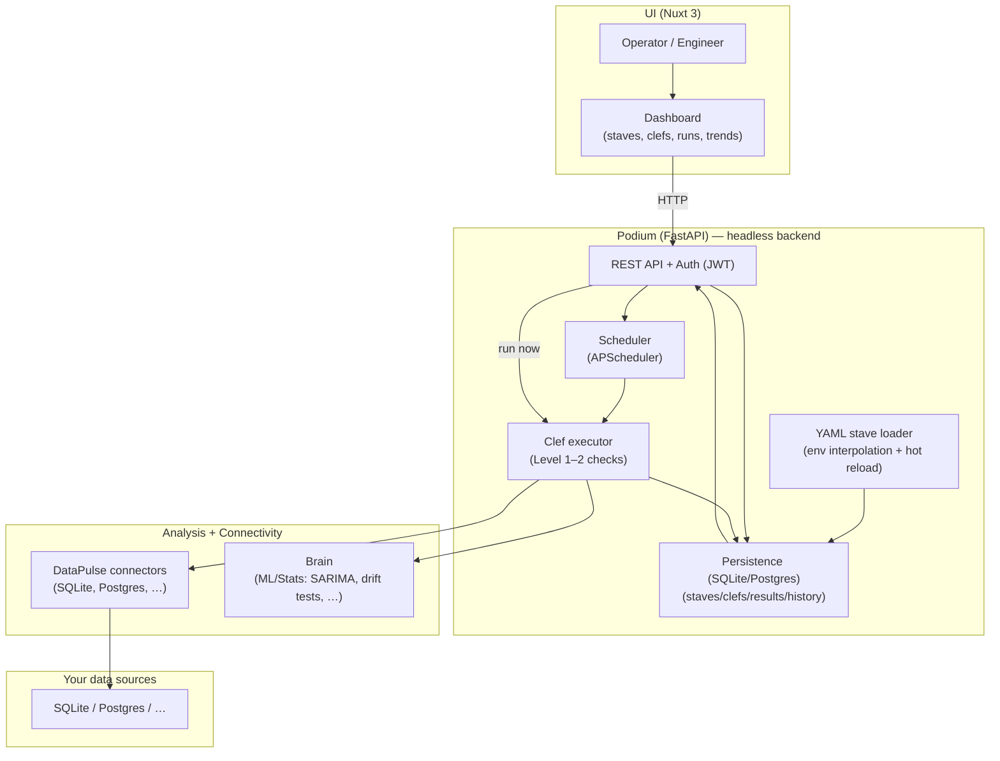

# DataMetronome — project showcase

## What it is
**DataMetronome is an open-source data quality & anomaly detection platform** that lets teams define checks as code (YAML), run them on a schedule or on-demand, and visualize results in a modern dashboard.

If you’ve ever asked “Is today’s data complete, fresh, and within expected behavior?”, DataMetronome is built to answer that question continuously—before downstream dashboards, ML models, or business logic break.

## What it’s for
- **Data quality guardrails**: catch nulls, duplicates, freshness/latency, and volume issues early.
- **Anomaly detection (ML/stats)**: detect unexpected shifts (e.g., order volume drops, pricing drift) based on historical behavior.
- **Operational visibility**: a UI for engineering/ops to see health, trends, and failures with drill-down.
- **“Checks as code” workflows**: configuration lives in YAML, can be reviewed, versioned, and deployed like application code.

## What you’ll see in the Retail Demo
A realistic e-commerce dataset (synthetic, generated locally) and a set of checks that demonstrate:
- **Level 1 (declarative) checks**: row count, freshness, column/value quality rules.
- **Level 2 (ML/stats) checks**: forecasting (SARIMA) and distribution drift (KS test) for “this looks different than normal”.

## Technologies (high level)
- **Backend API**: Python + **FastAPI** ("Podium")
- **Scheduling**: **APScheduler** (in-process, async-friendly)
- **Connectors (“DataPulse”)**: async DB access for **SQLite** and **PostgreSQL** (and more planned)
- **Anomaly/ML (“Brain”)**: statistical and ML tooling (e.g., **statsmodels**, **scikit-learn**)
- **Frontend**: **Nuxt 3** (TypeScript) + charting/visualization
- **Packaging/Tooling**: `uv`, `make`, Docker / Docker Compose

## How it works (architecture at a glance)

### Component model (schema)


### Glossary (the musical metaphor)
- **Stave**: the unit of monitoring configuration (what to monitor + how often + which checks).
- **Clef**: the set of checks (rules) applied to a Stave.
- **Podium**: the headless API backend (orchestration, auth, scheduling, persistence).
- **DataPulse**: connector libraries (how the system talks to databases).
- **Brain**: statistical/ML engine for intelligent checks.

## Design references (PDD/TDD)
- **PDD (product vision & conceptual model)**: `docs/PDD_DataMetronome.md`
- **TDD (overall architecture, data flow, components)**: `docs/TDD_DataPulse.md`
- **TDD (Clef & check architecture / tiered checks)**: `docs/TDD_Clefs.md`
- **More detail**: `docs/architecture.md`

---

## Start the Retail Demo

### Option A — Local (recommended for development)
From the repo root:

```bash
# 1) Install Python packages (dev mode)
make install

# 2) Generate the retail dataset DB (SQLite)
make retail-db

# 3) Import the Retail stave/clefs from YAML into Podium
#    IMPORTANT: DB_PATH must be an absolute path to the retail dataset DB
#    This automatically generates historical check results for better visualization
export DB_PATH="$(pwd)/datametronome/podium/data/retail.db"
python3 showcase/retail_demo/import_to_podium.py

# 4) Start Podium API (defaults to http://localhost:8000)
make start-podium
```

In a new terminal (repo root):

```bash
# 5) Start the UI (defaults to http://localhost:3000)
NUXT_PUBLIC_API_BASE="http://127.0.0.1:8000/api/v1" \
NUXT_PUBLIC_PODIUM_API_BASE="http://127.0.0.1:8000" \
make start-ui
```

Then:
- **UI**: http://localhost:3000
- **Login**: `admin` / `admin`
- **View checks**: Go to **Quality Checks** → click on any check card to see:
  - **Historical trends**: 7 days of past data showing baseline behavior
  - **Drift visualization**: Gradual distribution shift over time (not just a single outlier)
  - **Forecast graphs**: Normal behavior in the past + today's anomaly clearly highlighted

### Option B — Docker Compose (fast full-stack)
From the repo root:

```bash
# Builds and starts Podium + UI + a one-shot init container that bootstraps the retail demo
docker-compose -f docker-compose.showcase.yml up --build
```

Then:
- **UI**: http://localhost:3000
- **Podium API**: http://localhost:8001
- **API docs**: http://localhost:8001/docs
- **Login**: `admin` / `admin`

### Optional — CLI smoke run (no API/UI)
```bash
python3 showcase/retail_demo/run_demo.py
```

## Strengths
DataMetronome is designed to be **practical** (YAML checks, clear failures, easy local demo), **extensible** (connector + check architecture), and **production-minded** (API-first, scheduler, Docker-ready) so teams can move from “we noticed an issue” to “we prevent it” quickly.
